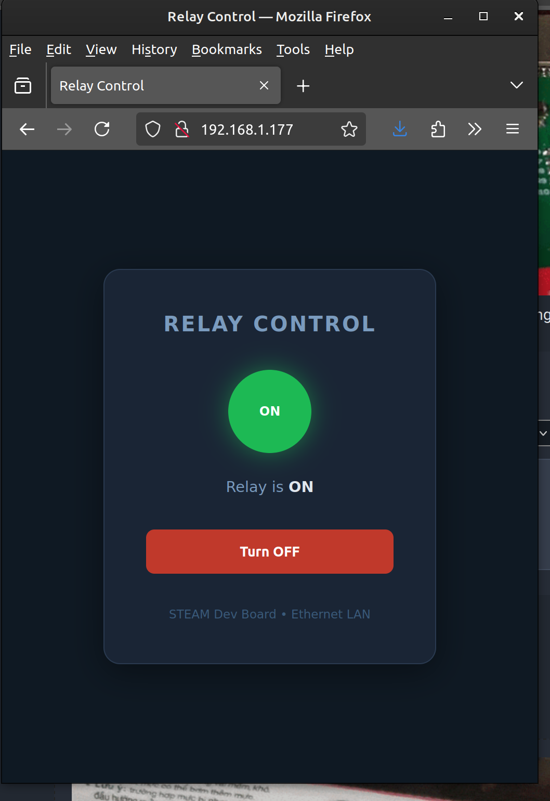

*************************************************************
Project 3 : Ethernet-Controlled Relay Switch via Web Browser
*************************************************************

Introduction
============

In this project, you will learn how to control a relay over a local area network (LAN) using a web browser. The ESP32-S3 hosts a small web server that any device on the same network can visit to toggle the relay ON or OFF — no internet connection, no cloud service, no app required.

By the end of this tutorial, you will know how to:

* Initialise the W5500 Ethernet chip over SPI with custom pin assignments.
* Start a simple HTTP web server on the ESP32-S3.
* Serve an HTML control page to a browser on the LAN.
* Parse HTTP requests to determine which action the user requested.
* Control a relay output based on browser input.

Requirements
============

Before starting, make sure you have the following:

* The STEAM development kit or The STEAM standalone microcontroller board
* USB cable (for programming)
* Arduino IDE with ESP32 toolchain installed
* A network switch or router with an available Ethernet port
* An Ethernet cable (Cat 5e or better)
* A device with a web browser (PC, phone, or tablet) on the same LAN

All relay and Ethernet hardware is already integrated on the STEAM development board. No external components are needed.

.. figure:: ../../img/MCU_board.png
   :align: center
   :width: 400
   :figclass: align-center

   The interfacing description of the microcontroller board

**Pin assignments used in this project:**

.. list-table::
   :header-rows: 1
   :widths: 30 20 50

   * - Signal
     - ESP32-S3 GPIO
     - Description
   * - SPI CLK
     - IO13
     - SPI clock to W5500
   * - SPI CS
     - IO14
     - Chip Select (active LOW)
   * - SPI MISO
     - IO12
     - Data from W5500 to ESP32-S3
   * - SPI MOSI
     - IO11
     - Data from ESP32-S3 to W5500
   * - RESET
     - IO9
     - Hardware reset for W5500 (active LOW)
   * - INT
     - IO10
     - Interrupt output from W5500 (unused in this project)
   * - Relay
     - IO45
     - Relay coil driver (HIGH = energised)

Background: Key Concepts
=========================

The W5500 Ethernet Controller
------------------------------

The W5500 is a hardwired TCP/IP Ethernet controller that handles the entire network stack in hardware. It communicates with the ESP32-S3 over the SPI bus, leaving the MCU free to run your application code. Because it contains its own TCP/IP engine, you do not need to manage packets, checksums, or protocol state machines — you simply open a socket and read or write data.

.. figure:: ../../img/w5500_block.png
   :align: center
   :width: 400
   :figclass: align-center

   W5500 internal block diagram

How the Web Server Works
-------------------------

When a browser visits ``http://<board-ip>/``, it sends an HTTP GET request — a short text message that identifies what page it wants. The ESP32-S3 reads that request, decides what to do (serve the main page, toggle the relay, etc.), and responds with an HTML document the browser renders.

This project uses **HTTP redirects after actions** (POST/Redirect/GET pattern) so that refreshing the browser does not accidentally re-send a relay command.

.. note::
   The web server in this project is single-client and synchronous — it handles one HTTP request at a time. This is perfectly adequate for a LAN control panel used by a small number of users.

Required Libraries
==================

This project uses the **Ethernet** library with W5500 support. Install it from the Arduino Library Manager:

1. Open Arduino IDE.
2. Go to **Tools → Manage Libraries**.
3. Search for **Ethernet** by the Arduino team (version 2.0 or later, which includes W5500 support).
4. Click **Install**.

.. note::
   The built-in ``Ethernet`` library uses ``Ethernet.init(csPin)`` to select the chip-select pin. Custom SPI pin remapping is done via ``SPI.begin(sck, miso, mosi, cs)`` before initialising Ethernet.

Writing the Program
===================

Create a new sketch in the Arduino IDE and enter the following code:

.. code-block:: cpp

   #include <SPI.h>
   #include <Ethernet.h>

   // ── Pin definitions ────────────────────────────────────────────────────────
   #define ETH_CLK    13
   #define ETH_CS     14
   #define ETH_MISO   12
   #define ETH_MOSI   11
   #define ETH_RESET   9
   #define ETH_INT    10    // Wired but not used in this project
   #define RELAY_PIN  45

   // ── Network configuration ──────────────────────────────────────────────────
   // MAC address — must be unique on your LAN.
   // The label on your board, or keep this default for a single-board setup.
   byte mac[] = { 0xDE, 0xAD, 0xBE, 0xEF, 0xFE, 0xED };

   // Static IP — change to suit your network (or use DHCP, see Experiments).
   IPAddress ip(192, 168, 1, 177);
   IPAddress gateway(192, 168, 1, 1);
   IPAddress subnet(255, 255, 255, 0);

   // ── Globals ────────────────────────────────────────────────────────────────
   EthernetServer server(80);   // Listen on port 80 (standard HTTP)
   bool relay_sts = false;      // Relay starts de-energised

   // ── HTML page ──────────────────────────────────────────────────────────────
   // Stored in flash (F macro) to save RAM.
   // The %STATE% and %BTN% tokens are replaced at runtime.
   const char HTML_TEMPLATE[] PROGMEM = R"rawhtml(
   <!DOCTYPE html>
   <html lang="en">
   <head>
     <meta charset="UTF-8">
     <meta name="viewport" content="width=device-width, initial-scale=1">
     <title>Relay Control</title>
     
   </head>
   <body>
     

       <h1>Relay Control</h1>
       
%INDLABEL%

       
Relay is %STATE%

       <form method="POST" action="/toggle">
         <button class="%BTNCLASS%">%BTNLABEL%</button>
       </form>
       
STEAM Dev Board &bull; Ethernet LAN

     

   </body>
   </html>
   )rawhtml";

   // ── Helper: send the control page ─────────────────────────────────────────
   void sendPage(EthernetClient& client) {
       // Build the response string from the template, substituting live values.
       String page = String((__FlashStringHelper*)HTML_TEMPLATE);
       if (relay_sts) {
           page.replace("%STATE%",    "ON");
           page.replace("%INDCLASS%", "on");
           page.replace("%INDLABEL%", "ON");
           page.replace("%BTNCLASS%", "btn-off");
           page.replace("%BTNLABEL%", "Turn OFF");
       } else {
           page.replace("%STATE%",    "OFF");
           page.replace("%INDCLASS%", "off");
           page.replace("%INDLABEL%", "OFF");
           page.replace("%BTNCLASS%", "btn-on");
           page.replace("%BTNLABEL%", "Turn ON");
       }

       client.println(F("HTTP/1.1 200 OK"));
       client.println(F("Content-Type: text/html"));
       client.println(F("Connection: close"));
       client.print(F("Content-Length: "));
       client.println(page.length());
       client.println();
       client.print(page);
   }

   // ── Helper: send a redirect response ──────────────────────────────────────
   void sendRedirect(EthernetClient& client, const char* location) {
       client.println(F("HTTP/1.1 303 See Other"));
       client.print(F("Location: "));
       client.println(location);
       client.println(F("Connection: close"));
       client.println();
   }

   // ── Setup ──────────────────────────────────────────────────────────────────
   void setup() {
       Serial.begin(115200);

       // Relay
       pinMode(RELAY_PIN, OUTPUT);
       digitalWrite(RELAY_PIN, relay_sts);

       // Hardware-reset the W5500
       pinMode(ETH_RESET, OUTPUT);
       digitalWrite(ETH_RESET, LOW);
       delay(10);
       digitalWrite(ETH_RESET, HIGH);
       delay(200);   // Allow W5500 to complete its internal reset

       // Remap SPI to the custom pins and init Ethernet
       SPI.begin(ETH_CLK, ETH_MISO, ETH_MOSI, ETH_CS);
       Ethernet.init(ETH_CS);
       Ethernet.begin(mac, ip, gateway, gateway, subnet);

       // Check hardware link
       if (Ethernet.hardwareStatus() == EthernetNoHardware) {
           Serial.println(F("ERROR: W5500 not found. Check SPI wiring."));
           while (true) { delay(1000); }  // Halt — nothing can be done
       }
       if (Ethernet.linkStatus() == LinkOFF) {
           Serial.println(F("WARNING: Ethernet cable not connected."));
       }

       server.begin();

       Serial.print(F("Server ready at http://"));
       Serial.println(Ethernet.localIP());
   }

   // ── Loop ───────────────────────────────────────────────────────────────────
   void loop() {
       EthernetClient client = server.available();
       if (!client) return;

       Serial.println(F("Client connected"));

       String request = "";
       bool   firstLine = true;
       String requestLine = "";

       // Read the HTTP request (first line contains method + path)
       while (client.connected()) {
           if (!client.available()) continue;

           char c = client.read();

           if (firstLine) {
               if (c == '\n') {
                   firstLine = false;
               } else if (c != '\r') {
                   requestLine += c;
               }
           } else {
               // Read and discard the remaining headers
               // until we reach the blank line (\r\n\r\n)
               request += c;
               if (request.endsWith("\r\n\r\n")) break;
           }
       }

       Serial.println("Request: " + requestLine);

       // Route the request
       if (requestLine.startsWith("POST /toggle")) {
           relay_sts = !relay_sts;
           digitalWrite(RELAY_PIN, relay_sts);
           Serial.print(F("Relay → "));
           Serial.println(relay_sts ? F("ON") : F("OFF"));
           sendRedirect(client, "/");          // PRG pattern: redirect after POST
       } else {
           sendPage(client);                   // GET / → serve the control page
       }

       // Give the browser time to receive the response, then close
       delay(10);
       client.stop();
       Serial.println(F("Client disconnected"));
   }

Uploading the Program
^^^^^^^^^^^^^^^^^^^^^

1. Connect the board to your computer using the USB cable.
2. **Before uploading**, edit the ``ip``, ``gateway``, and ``subnet`` variables to match your local network (see *Finding Your Network Settings* below).
3. Open the Arduino IDE.
4. Select **ESP32S3 Dev Module** from **Tools → Board → esp32**.
5. Select the correct serial port from **Tools → Port**.
6. Click the **Upload** button and wait for completion.
7. Open the **Serial Monitor** (Tools → Serial Monitor, baud 115200).
8. Connect an Ethernet cable between the board and your network switch or router.
9. The Serial Monitor will print the board's IP address once it is ready.

Finding Your Network Settings
^^^^^^^^^^^^^^^^^^^^^^^^^^^^^^

On **Windows**, open a Command Prompt and run ``ipconfig``. Look for the adapter connected to your LAN:

* **IPv4 Address** — your PC's address; assign the board a *different* unused address in the same range.
* **Default Gateway** — use this as the ``gateway`` value.
* **Subnet Mask** — use this as the ``subnet`` value.

On **macOS / Linux**, run ``ifconfig`` or ``ip addr`` in a terminal.

**Example:** if your PC shows ``192.168.1.100`` with gateway ``192.168.1.1`` and mask ``255.255.255.0``, you could assign the board ``192.168.1.177``.

   The relay control page as seen in a web browser

Expected Result
^^^^^^^^^^^^^^^

After uploading and connecting the Ethernet cable:

* The Serial Monitor prints the board's IP address.
* Opening that IP in any browser on the same LAN shows the relay control page.
* The page displays the current relay state (ON or OFF) with a colour indicator.
* Clicking the button toggles the relay — you will hear a click from the relay — and the page refreshes to show the new state.
* The relay state is preserved between browser sessions; only a power cycle resets it.

How the Code Works
^^^^^^^^^^^^^^^^^^

**Initialising the W5500**

The W5500 requires a hardware reset before use. The code drives ``ETH_RESET`` LOW for 10 ms and then HIGH, then waits 200 ms for the chip's internal power-on sequence to complete.

.. code-block:: cpp

   digitalWrite(ETH_RESET, LOW);
   delay(10);
   digitalWrite(ETH_RESET, HIGH);
   delay(200);

Because the W5500 is connected to non-default SPI pins, ``SPI.begin()`` is called with the custom GPIO assignments before ``Ethernet.init()``:

.. code-block:: cpp

   SPI.begin(ETH_CLK, ETH_MISO, ETH_MOSI, ETH_CS);
   Ethernet.init(ETH_CS);
   Ethernet.begin(mac, ip, gateway, gateway, subnet);

The code then checks that the W5500 was found (``EthernetNoHardware`` means the SPI wiring is wrong) and whether a cable is connected (``LinkOFF``).

**The Request Loop**

On every iteration of ``loop()``, the server checks for a waiting client. If one is present, it reads characters until the first line of the HTTP request is captured — for example:

::

   GET / HTTP/1.1
   POST /toggle HTTP/1.1

The remaining header lines are read and discarded. No request body is needed because the toggle action is encoded entirely in the URL path.

**Routing**

Two routes are handled:

.. list-table::
   :header-rows: 1
   :widths: 25 20 55

   * - HTTP Method
     - Path
     - Action
   * - GET
     - ``/``
     - Serve the HTML control page
   * - POST
     - ``/toggle``
     - Toggle relay, then redirect browser to ``/``

Any other path also falls through to ``sendPage()``, returning the main page.

**Post / Redirect / Get (PRG) Pattern**

After the toggle POST, the server replies with HTTP 303 (redirect to ``/``) rather than directly serving the page. This means if the user refreshes the browser, it performs a harmless GET instead of resubmitting the POST — preventing accidental double-toggles.

**The HTML Template**

The HTML page is stored in program flash (``PROGMEM``) using a raw-string literal. Five placeholder tokens (``%STATE%``, ``%INDCLASS%``, ``%INDLABEL%``, ``%BTNCLASS%``, ``%BTNLABEL%``) are replaced at runtime with values that reflect the current relay state before the response is sent.

The page is self-contained — no external CSS frameworks or JavaScript libraries are loaded — making it functional even without internet access on the LAN.

Experiment
^^^^^^^^^^

Try the following modifications to deepen your understanding.

* **Use DHCP** instead of a static IP so the router assigns the address automatically:

  .. code-block:: cpp

     // Replace Ethernet.begin(mac, ip, ...) with:
     if (Ethernet.begin(mac) == 0) {
         Serial.println(F("DHCP failed — check cable"));
         while (true) { delay(1000); }
     }
     Serial.print(F("DHCP address: "));
     Serial.println(Ethernet.localIP());

  .. note::
     With DHCP, the board's IP address may change after a reboot. Check the Serial Monitor or your router's client list to find the new address.

* **Add a status API endpoint** that returns the relay state as plain text, useful for automation scripts:

  .. code-block:: cpp

     } else if (requestLine.startsWith("GET /status")) {
         String body = relay_sts ? "ON" : "OFF";
         client.println(F("HTTP/1.1 200 OK"));
         client.println(F("Content-Type: text/plain"));
         client.print(F("Content-Length: "));
         client.println(body.length());
         client.println();
         client.print(body);

  Test it from a terminal on the same LAN: ``curl http://192.168.1.177/status``

* **Add separate ON and OFF endpoints** so a home-automation system can set state directly instead of toggling:

  .. code-block:: cpp

     } else if (requestLine.startsWith("POST /on")) {
         relay_sts = true;
         digitalWrite(RELAY_PIN, relay_sts);
         sendRedirect(client, "/");
     } else if (requestLine.startsWith("POST /off")) {
         relay_sts = false;
         digitalWrite(RELAY_PIN, relay_sts);
         sendRedirect(client, "/");

* **Add a page title and board name** to the HTML template so that multiple boards on the same LAN are easy to distinguish in browser tabs.

* **Blink the built-in LED** (GPIO8) whenever an HTTP request arrives, giving a visible indicator that the board is receiving traffic.

Troubleshooting
===============

.. list-table::
   :header-rows: 1
   :widths: 35 65

   * - Symptom
     - What to check
   * - Serial prints "W5500 not found"
     - Verify SPI wiring (CLK/MISO/MOSI/CS pins). Confirm the W5500 reset line is not stuck LOW.
   * - Serial prints "cable not connected"
     - Seat the Ethernet cable firmly. Try a different cable or port on the switch.
   * - Browser says "site can't be reached"
     - Confirm the board's static IP is in the same subnet as your PC. Ping the IP from a terminal (``ping 192.168.1.177``).
   * - Page loads but relay does not click
     - Check that GPIO45 is not held LOW by another peripheral. Confirm the relay supply voltage is present.
   * - Page shows wrong state after power cycle
     - Expected — ``relay_sts`` is a RAM variable. Add EEPROM or NVS storage to persist state across resets.
   * - Multiple rapid clicks when pressing the button
     - The browser submitted multiple requests. Confirm the PRG redirect is working (HTTP 303 after POST).

Summary
=======

In this tutorial, you learned how to turn the ESP32-S3 into a networked relay controller. The W5500 Ethernet chip is initialised over SPI using custom pin assignments, and the built-in ``Ethernet`` library manages the TCP/IP stack in hardware. A minimal HTTP server listens for browser requests, serves a self-contained HTML control page, and toggles a relay in response to user actions.

Key concepts covered include:

* Remapping SPI pins with ``SPI.begin(sck, miso, mosi, cs)`` for non-default hardware layouts.
* Initialising the W5500 with a hardware reset sequence.
* Configuring a static IP address to make the board consistently reachable on the LAN.
* Parsing HTTP request lines to route GET and POST requests.
* Implementing the Post/Redirect/Get (PRG) pattern to prevent duplicate actions on browser refresh.
* Serving a self-contained, styled HTML page from ``PROGMEM`` to conserve RAM.
* Controlling a relay output based on network input.

This project brings together SPI peripheral control, TCP/IP networking, HTTP protocol handling, and GPIO output in a single application — a common pattern in industrial IoT and home-automation firmware.
