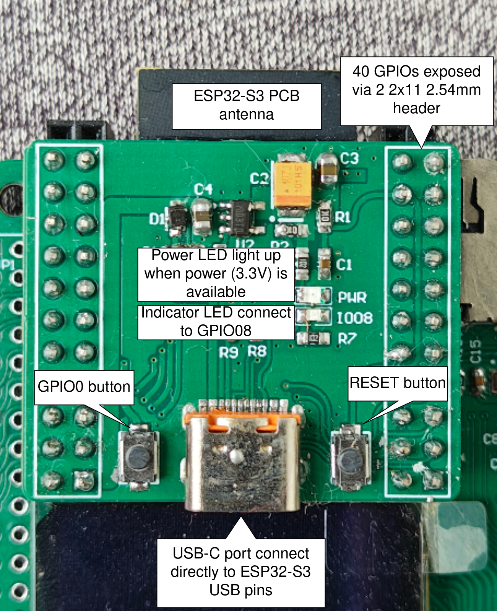

*****************************************************************
Project 6 : High-Resolution VGA Output — Text and Graphics
*****************************************************************

Introduction
============

In this project, you will turn the ESP32-S3 into a video card. The STEAM development board has a full VGA connector and a resistor-ladder digital-to-analogue converter (DAC) built in, isolated from the MCU's GPIOs by an **SN74LCV245** octal bus transceiver. By driving this hardware with bitluni's ``ESP32-S3-VGA`` library, you can output real, syncing VGA video to any standard monitor — no external frame buffer chip required. The ESP32-S3 generates the entire signal — pixel timing, horizontal sync, vertical sync, and colour — purely in software using its LCD peripheral.

By the end of this tutorial, you will know how to:

* Understand how the SN74LCV245 isolates and buffers the GPIOs driving the VGA resistor ladder.
* Understand the relationship between resolution, colour depth, and available memory (SRAM vs. PSRAM).
* Configure and install bitluni's ``ESP32-S3-VGA`` library.
* Initialise a VGA mode and draw text using the Adafruit GFX wrapper.
* Draw raw pixel graphics directly using the low-level drawing API.
* Choose the highest **stable** resolution for the ESP32-S3's onboard PSRAM.

Requirements
============

Before starting, make sure you have the following:

* The STEAM development kit or The STEAM standalone microcontroller board (8 MB Octal PSRAM variant — **N8R8**)
* USB cable
* Arduino IDE with ESP32 toolchain installed
* A VGA monitor or a VGA-capable display, plus a standard VGA cable

The VGA port, resistor-ladder DAC, and SN74LCV245 isolation buffer are already integrated on the STEAM development board. No external wiring is needed.

   The interfacing description of the microcontroller board

.. important::
   This project requires the **8 MB Octal PSRAM (N8R8)** variant of the ESP32-S3. High-resolution colour modes will fail to initialise on modules without PSRAM, because the frame buffer for anything above roughly 320×240 does not fit in the chip's internal SRAM.

Background: Key Concepts
=========================

How Software-Generated VGA Works
-----------------------------------

VGA is an analogue video standard, but the ESP32-S3 is a digital chip. To generate analogue-looking video, the board uses a **resistor ladder DAC**: each colour channel (Red, Green, Blue) is driven by several GPIO pins, each connected through a resistor of a different value to the same output node. By switching combinations of these GPIOs high or low, the combined voltage on that node approximates an analogue level — more bits per colour channel means finer voltage steps and smoother colour gradients.

The ESP32-S3's **LCD_CAM peripheral** (normally intended for driving LCD panels) is repurposed here to clock these GPIOs out at high speed with precise, hardware-generated timing, alongside the HSync and VSync pulses that tell the monitor when each line and frame begins. This is the same fundamental trick bitluni used in earlier ESP32 boards via I²S, but the ESP32-S3 version uses the newer, more capable LCD peripheral, which is why the original ESP32 VGA library is not compatible with the S3.

.. figure:: ../../img/vga_resistor_ladder.png
   :align: center
   :width: 450
   :figclass: align-center

   GPIOs driving a resistor-ladder DAC to produce analogue colour voltage levels

The Role of the SN74LCV245
------------------------------

The SN74LCV245 is an **octal bus transceiver** — eight bidirectional buffer channels in one chip, normally used to let two buses at different voltage levels or drive strengths talk to each other safely.

On the STEAM board, the SN74LCV245 sits between the ESP32-S3's GPIOs and the resistor-ladder network feeding the VGA connector. It serves two purposes:

* **Electrical isolation** — the resistor ladder and the VGA connector present a real-world load (cable capacitance, monitor input impedance, potential static discharge from plugging in a cable) that could otherwise stress or damage the MCU's GPIO pins directly. The buffer chip absorbs this.
* **Drive strength** — VGA's resistor ladder needs to switch relatively quickly and supply enough current at each output to charge cable capacitance for clean edges. The SN74LCV245 is a dedicated high-speed driver, more consistent than relying on the ESP32-S3's GPIO drivers directly.

.. note::
   Because the buffer is configured for one-directional output (MCU → VGA connector) in this design, you do not need to manage any direction-control logic in software. From the Arduino sketch's perspective, the GPIOs behave exactly as if they were wired straight to the resistor ladder — the isolation is entirely transparent to your code.

Resolution, Colour Depth, and Memory
---------------------------------------

The frame buffer — the block of memory holding every pixel's colour value — must fit somewhere in the chip's memory. Its size is simply ``width × height × bytes-per-pixel``. This creates a direct trade-off between resolution, colour depth, and how much memory is available:

.. list-table::
   :header-rows: 1
   :widths: 25 20 20 35

   * - Resolution
     - Colour Depth
     - Frame Buffer Size
     - Memory Required
   * - 320×240
     - 16-bit
     - 150 KB
     - Fits in internal SRAM
   * - 640×480
     - 16-bit
     - 600 KB
     - Requires PSRAM
   * - 800×600
     - 16-bit
     - 960 KB
     - Requires PSRAM — recommended ceiling for reliable colour
   * - 1024×768
     - 8-bit
     - 768 KB
     - Requires PSRAM — usable, occasional glitches reported
   * - 1280×720
     - 8-bit
     - 900 KB
     - Requires PSRAM — documented as experimental, sync issues common

.. warning::
   The library's documentation and community testing both describe higher resolutions as **experimental**. Resolutions up to 800×600 at 60 Hz with 16-bit colour work reliably, while 1280×720 (achieved by dropping to 8-bit colour) and similar very-high resolutions can suffer from cache-related glitches at the start of each frame, with 1024×768 generally recommended as the practical highest resolution before instability appears. This lesson therefore targets **800×600 at 16-bit colour** as the highest resolution that is both maximally detailed and dependably stable — true "highest possible" in the sense of usable, not just theoretical.

Required Libraries
==================

This project uses three components, installed in a specific order.

1. **ESP32 board support** — confirm you already have the ESP32 board package installed (``Tools → Board → Boards Manager``, search "esp32").

2. **Adafruit GFX Library** — install via the Arduino Library Manager (``Tools → Manage Libraries``, search "Adafruit GFX Library"). This provides the text-drawing and shape-drawing API used by the GfxWrapper.

3. **ESP32-S3-VGA library** — this library is not yet published in the Arduino Library Manager, so it must be installed manually:

   a. Download the repository as a ZIP from `github.com/bitluni/ESP32-S3-VGA <https://github.com/bitluni/ESP32-S3-VGA>`_ (Code → Download ZIP).
   b. In the Arduino IDE, go to **Sketch → Include Library → Add .ZIP Library…** and select the downloaded file.
   c. Restart the Arduino IDE.

.. note::
   After installation, example sketches will appear under **File → Examples → bitluni ESP32-S3-VGA**, but the code in this lesson is self-contained and does not require opening them.

Required Arduino IDE Settings
================================

Go to **Tools** and set the following before uploading. These match the official requirements for the VGA library:

.. list-table::
   :header-rows: 1
   :widths: 30 35 35

   * - Setting
     - Required Value
     - Why
   * - Board
     - **ESP32S3 Dev Module**
     - Targets the correct chip variant
   * - CPU Frequency
     - **240 MHz (WiFi)**
     - The LCD peripheral needs full clock speed for stable high-resolution timing
   * - Flash Size
     - **8 MB (64 Mb)**
     - Matches the STEAM board's flash
   * - PSRAM
     - **OPI PSRAM**
     - **Critical.** Without this, the frame buffer cannot be allocated and ``vga.init()`` will fail
   * - USB CDC On Boot
     - **Enabled**
     - Allows Serial Monitor over the native USB port for this project

.. warning::
   If ``PSRAM`` is left at its default of "Disabled", any resolution above roughly 320×240 will fail to initialise. This is the single most common cause of a blank screen with this library.

Writing the Program — Part 1: Displaying Text
================================================

This first sketch demonstrates the simplest possible use of the library: initialising 800×600 VGA output and printing text using the familiar Adafruit GFX ``print()`` API via bitluni's ``GfxWrapper``.

.. code-block:: cpp

   #include <ESP32S3VGA.h>
   #include <GfxWrapper.h>

   // ── VGA pin configuration ──────────────────────────────────────────────────
   // Order: R0..R4, G0..G5, B0..B4, HSync, VSync
   // These map to the resistor-ladder DAC inputs through the SN74LCV245 buffer.
   const PinConfig pins(
       4, 5, 6, 7, 8,           // Red   (5 bits)
       9, 10, 11, 12, 13, 14,   // Green (6 bits)
       15, 16, 17, 18, 21,      // Blue  (5 bits)
       1, 2                     // HSync, VSync
   );

   // ── VGA device and display mode ──────────────────────────────────────────
   VGA vga;
   Mode mode = Mode::MODE_800x600x60;   // Highest stable resolution, 60 Hz

   // ── Adafruit GFX wrapper — gives access to print(), drawing primitives ───
   GfxWrapper<VGA> gfx(vga, mode.hRes, mode.vRes);

   void setup() {
       Serial.begin(115200);

       // Use 2 frame buffers for tear-free updates
       vga.bufferCount = 2;

       // Initialise: pin config, mode, bits per pixel (16-bit colour)
       if (!vga.init(pins, mode, 16)) {
           Serial.println("VGA init failed! Check PSRAM setting in Tools menu.");
           while (true) { delay(1000); }
       }

       vga.start();

       // Clear the screen to black
       vga.clear(vga.rgb(0, 0, 0));

       // Configure text appearance
       gfx.setTextColor(vga.rgb(255, 255, 255));  // White text
       gfx.setTextSize(2);                         // 2x scale
       gfx.setCursor(40, 40);
       gfx.print("Hello, VGA!");

       gfx.setTextSize(1);
       gfx.setCursor(40, 90);
       gfx.print("ESP32-S3  -  800x600  -  16-bit color");

       gfx.setCursor(40, 110);
       gfx.print("STEAM Development Board");
   }

   void loop() {
       // Nothing needed here for a static text display.
       // The VGA signal continues to be generated automatically
       // by the LCD peripheral in the background.
   }

Uploading the Program
^^^^^^^^^^^^^^^^^^^^^

1. Connect the board to your computer using the USB cable.
2. Confirm all settings in the **Required Arduino IDE Settings** table above, especially **PSRAM: OPI PSRAM**.
3. Select the correct serial port from **Tools → Port**.
4. Click the **Upload** button and wait for completion.
5. Connect a VGA cable from the board to a monitor.
6. Power-cycle the board (or it should already be running after upload).

.. figure:: ../../img/vga_hello_world.png
   :align: center
   :figclass: align-center

   "Hello, VGA!" rendered at 800×600 on a connected monitor

Expected Result
^^^^^^^^^^^^^^^

After uploading and connecting the monitor:

* The monitor should sync immediately and show a black screen.
* The text **"Hello, VGA!"** appears near the top-left in white, at double size.
* Two additional lines of smaller text appear below, confirming the resolution and board name.
* The image should be sharp and stable, with no visible flicker, tearing, or rolling.

How the Code Works
^^^^^^^^^^^^^^^^^^

**Pin Configuration**

The ``PinConfig`` constructor takes 18 arguments in a fixed order: five Red bits, six Green bits, five Blue bits, then HSync and VSync. This 5-6-5 split matches the RGB565 colour format used internally — green gets one extra bit because the human eye is more sensitive to green luminance variation, a convention shared with most 16-bit colour formats.

.. code-block:: cpp

   const PinConfig pins(
       4, 5, 6, 7, 8,           // R0 (LSB) .. R4 (MSB)
       9, 10, 11, 12, 13, 14,   // G0 (LSB) .. G5 (MSB)
       15, 16, 17, 18, 21,      // B0 (LSB) .. B4 (MSB)
       1, 2                     // HSync, VSync
   );

These GPIO numbers correspond to the STEAM board's fixed wiring to the resistor ladder via the SN74LCV245 — you do not need to change them unless you are using different hardware.

**Mode Selection**

``Mode::MODE_800x600x60`` is a pre-defined timing configuration built into the library, specifying the resolution and refresh rate together. The library includes several pre-defined modes for common resolutions; using a named mode is far simpler than calculating VGA timing parameters (front porch, sync pulse width, back porch) by hand.

**Initialisation Sequence**

.. code-block:: cpp

   vga.bufferCount = 2;
   if (!vga.init(pins, mode, 16)) { /* handle failure */ }
   vga.start();

Setting ``bufferCount = 2`` enables **double buffering**: one frame buffer is being displayed while you draw into the other, then the library swaps them. This eliminates tearing artefacts when content changes, at the cost of double the frame buffer memory — a worthwhile trade-off given the 8 MB of available PSRAM.

``vga.init()`` allocates the frame buffer(s) and configures the LCD peripheral's timing registers to match the chosen mode. It returns ``false`` if memory allocation fails — almost always because PSRAM is not enabled in the Tools menu. ``vga.start()`` then begins continuously streaming the frame buffer out as a live VGA signal; from this point on, anything in the frame buffer appears on the monitor automatically, with no further action required in ``loop()``.

**Drawing Text with GfxWrapper**

``GfxWrapper<VGA>`` is bitluni's adapter class that implements the interface Adafruit GFX expects, translating drawing calls (``drawPixel()``, ``fillRect()``, font rendering, and so on) into writes against the VGA frame buffer. Once wrapped, the full Adafruit GFX API becomes available — including the ``print()`` family of functions used here:

.. code-block:: cpp

   gfx.setTextColor(vga.rgb(255, 255, 255));
   gfx.setTextSize(2);
   gfx.setCursor(40, 40);
   gfx.print("Hello, VGA!");

``vga.rgb(r, g, b)`` converts standard 8-bit-per-channel RGB values (0–255 each) into the packed 16-bit colour format the frame buffer actually stores, so you can think in familiar RGB terms without manual bit-packing.

Writing the Program — Part 2: Drawing Raw Graphics
=====================================================

This second sketch bypasses Adafruit GFX entirely and uses the library's low-level pixel API directly, generating a colour gradient test pattern — useful both as a visual demonstration and as a way to confirm every bit of the resistor ladder is wired and functioning correctly.

.. code-block:: cpp

   #include <ESP32S3VGA.h>

   // ── VGA pin configuration (same as Part 1) ─────────────────────────────────
   const PinConfig pins(
       4, 5, 6, 7, 8,
       9, 10, 11, 12, 13, 14,
       15, 16, 17, 18, 21,
       1, 2
   );

   VGA vga;
   Mode mode = Mode::MODE_800x600x60;

   void setup() {
       Serial.begin(115200);

       vga.bufferCount = 2;
       if (!vga.init(pins, mode, 16)) {
           Serial.println("VGA init failed! Check PSRAM setting in Tools menu.");
           while (true) { delay(1000); }
       }
       vga.start();
   }

   void loop() {
       // ── Draw a full-screen horizontal colour gradient ───────────────────────
       for (int y = 0; y < mode.vRes; y++) {
           for (int x = 0; x < mode.hRes; x++) {
               // Map horizontal position to a 0-255 gradient value
               uint8_t level = (uint8_t)((x * 255L) / mode.hRes);
               vga.dot(x, y, level, 255 - level, 128);
           }
       }

       // ── Draw RGB calibration bars across the top 60 rows ────────────────────
       for (int y = 0; y < 60; y++) {
           for (int x = 0; x < 256; x++) {
               vga.dot(x,       y,      x, 0, 0);   // Pure red ramp
               vga.dot(x + 270, y,      0, x, 0);   // Pure green ramp
               vga.dot(x + 540, y,      0, 0, x);   // Pure blue ramp
           }
       }

       // ── Present the completed frame ─────────────────────────────────────────
       vga.show();

       delay(16);   // Roughly matches the 60 Hz refresh — avoids redrawing faster than needed
   }

Expected Result
^^^^^^^^^^^^^^^

After uploading this sketch:

* The top 60 rows of the screen show three 256-pixel-wide colour ramps: pure red, pure green, and pure blue, each going from black to full brightness left-to-right.
* The remainder of the screen shows a smooth diagonal-feeling gradient blending orange and teal tones across the width of the display.
* If any vertical banding, missing colour channel, or stuck-at-one-colour artefacts appear, this points to a specific GPIO or resistor in the ladder — see Troubleshooting below.

How the Code Works
^^^^^^^^^^^^^^^^^^

**The Low-Level Drawing API**

``vga.dot(x, y, r, g, b)`` writes a single pixel directly into the active (off-screen) frame buffer, taking individual 0–255 red, green, and blue values and packing them internally. Unlike the GFX wrapper's abstraction, this gives you direct per-pixel control and is the fastest possible way to generate procedural graphics, since there is no intermediate object-oriented drawing layer.

**Manual Frame Presentation**

.. code-block:: cpp

   vga.show();

When using ``vga.dot()`` directly (without going through GfxWrapper), you call ``vga.show()`` once all drawing for the frame is complete. With double buffering enabled, this swaps the buffer you just finished drawing into to become the one actively being scanned out to the monitor, while the previously-displayed buffer becomes available for your next frame's drawing calls.

**Why This Test Pattern Is Useful**

The RGB calibration bars isolate each colour channel completely — the red bar uses only the Red GPIO bits, with Green and Blue held at zero, and so on. If, for example, the green bar shows banding or doesn't reach full brightness, that specifically implicates the Green channel's resistor ladder or its associated SN74LCV245 buffer channel, dramatically narrowing down a hardware fault without needing an oscilloscope.

Experiment
^^^^^^^^^^

Try the following modifications to deepen your understanding.

* **Try a lower, guaranteed-stable resolution** for comparison:

  .. code-block:: cpp

     Mode mode = Mode::MODE_320x240x60;   // Fits entirely in internal SRAM

  Notice that initialisation is faster and the image is rock solid — useful as a reference point when troubleshooting higher resolutions.

* **Animate the gradient** by adding a time-based offset, turning the static test pattern into a moving one:

  .. code-block:: cpp

     static uint8_t offset = 0;
     uint8_t level = (uint8_t)(((x + offset) * 255L) / mode.hRes) % 256;
     // ... after the drawing loops, before vga.show():
     offset++;

* **Combine text and graphics in one frame.** Use ``GfxWrapper`` for text as in Part 1, but also call ``vga.dot()`` for custom shapes — both write to the same underlying frame buffer, so they compose naturally:

  .. code-block:: cpp

     GfxWrapper<VGA> gfx(vga, mode.hRes, mode.vRes);
     // ... after drawing your dots in loop():
     gfx.setCursor(10, 10);
     gfx.print("FPS test pattern");

* **Display a bitmap image.** Convert a small image to a C array (many online tools do this, exporting RGB565 arrays compatible with this frame buffer format), then iterate over it with ``vga.dot()`` to render a real picture instead of a procedural gradient.

* **Measure your actual frame rate.** Add a ``millis()``-based counter around the render loop and print frames-per-second to Serial once per second — useful for understanding how much CPU budget remains for game logic, sensor reads, or other tasks alongside video generation.

Troubleshooting
===============

.. list-table::
   :header-rows: 1
   :widths: 35 65

   * - Symptom
     - What to check
   * - Monitor shows "No Signal"
     - Confirm ``PSRAM`` is set to **OPI PSRAM** in Tools, and that ``vga.init()`` returned ``true`` (check Serial Monitor for the failure message).
   * - Screen syncs but is solid black
     - Confirm ``vga.start()`` is called after ``vga.init()``, and that drawing calls happen after both.
   * - Image is present but rolls or jitters vertically
     - VSync wiring or timing issue. Confirm GPIO 2 (VSync) is unobstructed; try a different, known-good VGA cable.
   * - Image is squeezed, stretched, or shows diagonal tearing
     - HSync timing issue, often from running other heavy code in ``loop()`` that starves the LCD peripheral. Keep per-frame work light, or reduce resolution.
   * - One colour channel is missing or stuck
     - Check the corresponding GPIO group (R: 4–8, G: 9–14, B: 15–18,21) and the SN74LCV245's connections for that channel. The RGB calibration bar test pattern (Part 2) isolates this precisely.
   * - Works at 320×240 but fails at 800×600
     - Confirm PSRAM is actually enabled — this is the most common cause. Re-check the Tools menu setting and re-upload; this setting does not persist if accidentally reset.
   * - Visible glitch or shift at the top of the frame at very high resolution (1024×768 / 1280×720)
     - This is a known, documented limitation of the current library at extreme resolutions due to PSRAM cache behaviour. Drop to 800×600 at 16-bit colour for reliable output.
   * - Upload succeeds but board does not reset into the new program
     - Hold the BOOT button while pressing RESET, then release BOOT, to force programming mode, then re-select the correct port.

Summary
=======

In this tutorial, you turned the ESP32-S3 into a self-contained VGA video generator, using the chip's LCD peripheral to produce real, monitor-syncing analogue video entirely in software — no dedicated video chip required.

Key concepts covered include:

* How a **resistor-ladder DAC** converts multiple digital GPIO outputs into an analogue colour voltage.
* The role of the **SN74LCV245** bus transceiver in electrically isolating and buffering the MCU's GPIOs from the VGA connector's resistor ladder, transparently to your code.
* The direct trade-off between **resolution, colour depth, and frame buffer memory**, and why PSRAM is mandatory for anything beyond the smallest resolutions.
* Installing and configuring bitluni's **ESP32-S3-VGA** library, including the critical **OPI PSRAM** Tools setting.
* Initialising a VGA mode with ``PinConfig``, ``Mode``, ``vga.init()``, and ``vga.start()``.
* Drawing text using the **Adafruit GFX** API via ``GfxWrapper``.
* Drawing raw pixel graphics directly with ``vga.dot()`` and presenting completed frames with ``vga.show()``.
* Choosing **800×600 at 16-bit colour** as the practical highest-resolution mode that remains reliably stable on current hardware and library versions.

This project demonstrates that with the right peripheral (the LCD_CAM block) and the right supporting hardware (a resistor ladder and isolation buffer), a general-purpose microcontroller can generate broadcast-quality analogue video — a technique with applications in retro computing, custom instrumentation displays, and standalone graphical user interfaces that need no separate display driver chip.
