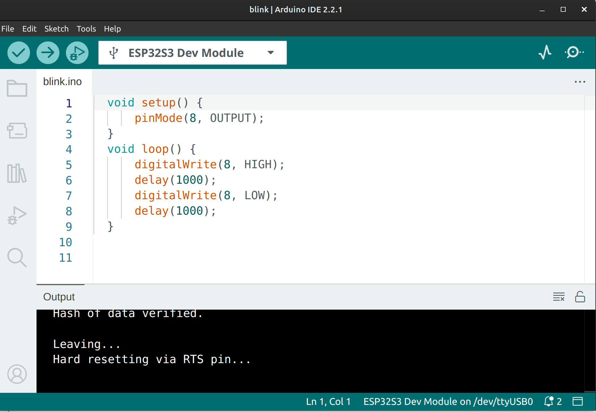

*************************************************************
Project 0 : The cliché "Hello World !" in the hardware world
*************************************************************

Introduction
============ 

In this very first project, this experiment will guide you through the infamous "Hello World !" of the microcontroller world by making an LED blink. By the end of this tutorial, you will know how to:

* Upload a program to the STEAM development board.
* Understand the basic setting for the ESP32-S3 within the development kit .

Requirements
============
Before starting, make sure you have the following:

* The STEAM development kit or The STEAM standalone microcontroller board 
* USB cable
* Arduino IDE with ESP32 toolchain installed

In this project the built-in LED will be used, no external components are required.

.. figure:: ../../img/MCU_board.png
   :align: center
   :width: 400
   :figclass: align-center

   The interfacing description of the microcontroller board 

The build in LED on **GPIO08** will be used
## Writing the Program

Create a new sketch in the Arduino IDE and enter the following code:

.. code-block:: cpp

    void setup() {
        pinMode(8, OUTPUT);
    }
    void loop() {
        digitalWrite(8, HIGH);
        delay(1000);
        digitalWrite(8, LOW);
        delay(1000);
    }

Uploading the Program
^^^^^^^^^^^^^^^^^^^^^

1. Connect the Arduino board to your computer using the USB cable.
2. Open the Arduino IDE.
3. Select **ESP32S3 Dev Module** from **Tools → Board → esp32**.
4. Select the correct serial port obtained when the board is connected to the computer from **Tools → Port**.
5. Click the **Upload** button.
6. Wait until the upload is complete.

   Blink sketch after successfully uploaded to the STEAM development kit

Expected Result
^^^^^^^^^^^^^^^

After the program has been uploaded successfully:

* The LED turns **ON** for one second.
* The LED turns **OFF** for one second.
* The process repeats continuously.

How the Code Works
^^^^^^^^^^^^^^^^^^
**`setup()`**

The `setup()` function runs **once** when the Arduino starts.

.. code-block:: cpp

    pinMode(8, OUTPUT);

This configures pin 8 as an output so it can control the LED.

**`loop()`**

The `loop()` function runs repeatedly.

.. code-block:: cpp

    digitalWrite(8, HIGH);

Turns the LED on.

.. code-block:: cpp

    delay(1000);

Waits for 1000 milliseconds (1 second).

.. code-block:: cpp

    digitalWrite(8, LOW);

Turns the LED off.

Another one-second delay is added before the loop repeats.

Experiment
^^^^^^^^^^
Try changing the delay values.

For example:

.. code-block:: cpp

    delay(500);

The LED will blink twice as fast.

Or try:

.. code-block:: cpp

    delay(200);

The LED will blink very quickly.

Summary
^^^^^^^

Congratulations! You have completed your first Arduino project.

You learned how to:

* Configure a GPIO pin as an output.
* Turn an LED on and off.
* Use the `delay()` function to control timing.
* Upload a program to an Arduino board.

This simple project forms the foundation for many more Arduino projects involving sensors, motors, displays, and other electronic components.
