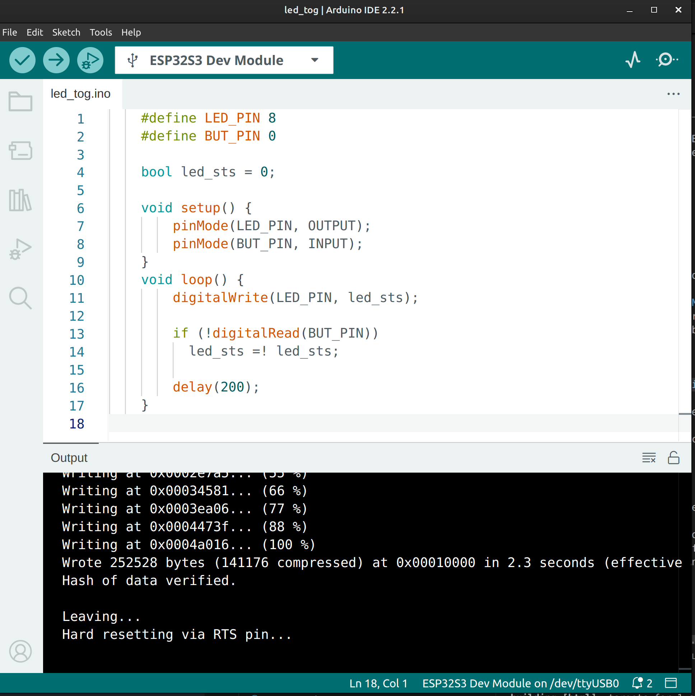

*************************************************************
Project 1 : Turn ON and OFF the LED using a button 
*************************************************************

Introduction
============ 

In this project, we will learn how to turn ON and OFF a LED light using just a button, similar to a household light switch but using button and programming logic instead a "dumb" switch. By the end of this tutorial, you will know how to:

* Read button as an input from the MCU.
* Write the output signal to the LED
* Understand the programming logic to use single button event to change the LED states.

Requirements
============

Before starting, make sure you have the following:

* The STEAM development kit or The STEAM standalone microcontroller board 
* USB cable
* Arduino IDE with ESP32 toolchain installed

In this project the built-in LED and button will be used, no external components are required.

.. figure:: ../../img/MCU_board.png
   :align: center
   :width: 400
   :figclass: align-center

   The interfacing description of the microcontroller board 

The build in LED on **GPIO08** and the button on **GPIO0** will be used

.. note::
    The button here is read logic LOW when being pressed based on the schematic

Writing the Program
===================

Create a new sketch in the Arduino IDE and enter the following code:

.. code-block:: cpp

    #define LED_PIN 8
    #define BUT_PIN 0

    bool led_sts = 0;

    void setup() {
        pinMode(LED_PIN, OUTPUT);
        pinMode(BUT_PIN, INPUT);
    }
    void loop() {
        digitalWrite(LED_PIN, led_sts);

        if (digitalRead(BUT_PIN))
            led_sts != led_sts;
        
        delay(300);
    }

Uploading the Program
^^^^^^^^^^^^^^^^^^^^^

1. Connect the Arduino board to your computer using the USB cable.
2. Open the Arduino IDE.
3. Select **ESP32S3 Dev Module** from **Tools → Board → esp32**.
4. Select the correct serial port obtained when the board is connected to the computer from **Tools → Port**.
5. Click the **Upload** button.
6. Wait until the upload is complete.

Expected Result
^^^^^^^^^^^^^^^

After uploading the program to the Arduino board:

* The LED is initially turned **OFF**.
* Each time the push button is pressed, the LED changes its state.
* If the LED is OFF, pressing the button turns it ON.
* If the LED is ON, pressing the button turns it OFF.
* A short delay of 300 ms helps reduce multiple toggles caused by button bouncing.

How the Code Works
^^^^^^^^^^^^^^^^^^
**`setup()`**

The `setup()` function runs once when the Arduino starts.

.. code-block:: cpp

    pinMode(LED_PIN, OUTPUT);
    pinMode(BUT_PIN, INPUT);

* `LED_PIN` is configured as an output to drive the LED.
* `BUT_PIN` is configured as an input to read the push button.

`loop()`

The `loop()` function executes continuously.

First, the current LED state stored in `led_sts` is written to the LED pin.

.. code-block:: cpp

    digitalWrite(LED_PIN, led_sts);

Next, the program checks whether the button is pressed.

.. code-block:: cpp

    if (digitalRead(BUT_PIN))
    led_sts = !led_sts;

If the button input is HIGH, the value of `led_sts` is inverted. This changes the LED from ON to OFF or from OFF to ON.

Finally, the program waits for 300 milliseconds.

.. code-block:: cpp

    delay(300);

This delay slows down the loop and helps prevent the LED from toggling multiple times due to the mechanical bouncing of the push button.

Experiment
^^^^^^^^^^

Try modifying the program to better understand how it works.

* Change the delay from `300` ms to `100` ms or `500` ms and observe how the button response changes.

* Initialize `led_sts` to `true` so the LED starts in the ON state.

  .. code-block:: cpp

    bool led_sts = true;

* Replace the delay with a software debounce algorithm for more responsive button detection.

Summary
^^^^^^^
In this tutorial, you learned how to use a push button to control an LED. The program continuously reads the button state and stores the LED status in a Boolean variable. Whenever the button is pressed, the stored state is inverted, causing the LED to toggle between ON and OFF.

Key concepts covered include:

* Configuring GPIO pins as **INPUT** and **OUTPUT**.
* Reading the state of a push button using **digitalRead()**.
* Controlling an LED using **digitalWrite()**.
* Using a Boolean variable to store the LED's current state.
* Toggling a variable using the logical NOT (!) operator.
* Using a short delay to reduce the effects of button bouncing.

This project introduces basic digital input and output operations, providing a foundation for more advanced Arduino applications involving buttons, switches, sensors, and user interfaces.
