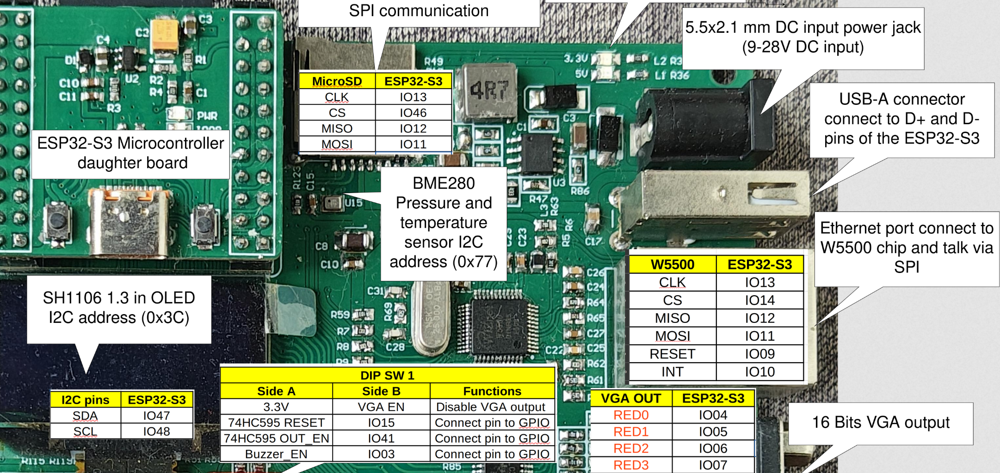
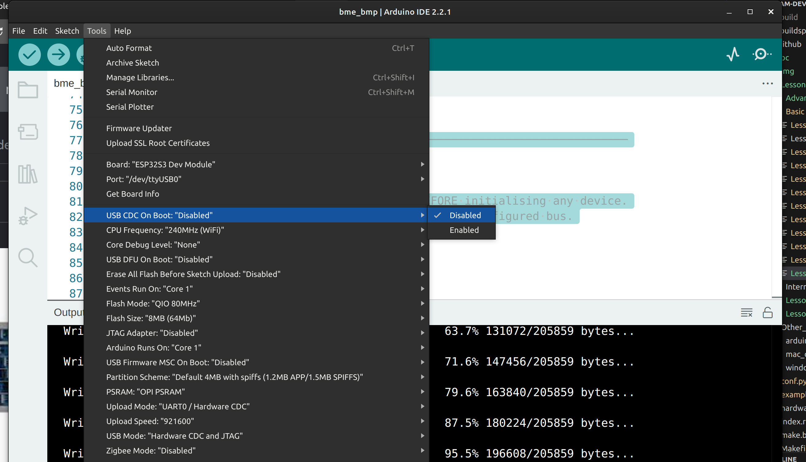
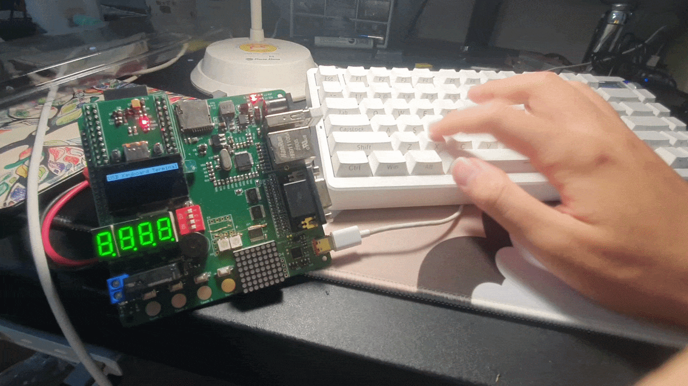

***************************************************************
Project 11 : USB Keyboard Input Displayed on the OLED Screen
***************************************************************

Introduction
============

In this project, you will explore one of the most powerful — and least well-known — features of the ESP32-S3: its built-in USB On-The-Go (OTG) controller operating in **host mode**. Instead of the ESP32-S3 acting as a USB device (as it does when you plug it into your computer for programming), it will become the USB *host* — the controller — allowing you to plug in a standard USB keyboard and read every keystroke.

Each key pressed on the keyboard will be decoded and displayed on the on-board SH1106 OLED screen, building a simple text terminal.

By the end of this tutorial, you will know how to:

* Understand the difference between USB device mode and USB host mode.
* Configure the Arduino IDE correctly to enable USB host functionality.
* Use the ``EspUsbHost`` library to receive keyboard events via a callback.
* Decode HID keycodes into printable ASCII characters.
* Drive the SH1106 OLED display with the U8g2 library using custom I²C pins.
* Safely share data between a USB background task and the main loop using a mutex.

Requirements
============

Before starting, make sure you have the following:

* The STEAM development kit or The STEAM standalone microcontroller board
* A standard USB keyboard (USB HID Boot Protocol compatible — virtually all modern keyboards qualify)
* A USB Type-A to Type-C OTG cable, or a USB hub with Type-C input, to connect the keyboard to the board's USB port
* Arduino IDE with ESP32 toolchain installed (esp32 board package version **3.0 or later**)

The SH1106 OLED display is already integrated on the STEAM development board. No additional components are needed.

   The interfacing description of the microcontroller board

**Pin assignments used in this project:**

.. list-table::
   :header-rows: 1
   :widths: 30 20 50

   * - Signal
     - ESP32-S3 GPIO
     - Description
   * - OLED SCL
     - IO48
     - I²C clock line to SH1106
   * - OLED SDA
     - IO47
     - I²C data line to SH1106
   * - USB D+ / D−
     - IO19 / IO20
     - Built-in USB OTG data lines (fixed, internal)

.. note::
   The USB D+ and D− lines (IO19 and IO20) are connected internally to the USB connector on the STEAM board. You do not wire these manually — they are used automatically when you plug a keyboard into the board's USB port.

Background: Key Concepts
=========================

USB Device Mode vs. USB Host Mode
-----------------------------------

Every USB connection has two roles: a **host** (the controller that manages the bus and enumerates devices) and a **device** (the peripheral being controlled). In everyday use, your computer is the host and your keyboard, mouse, or ESP32 board is the device.

The ESP32-S3's USB OTG controller can operate in **either role**:

* **Device mode** (default) — the ESP32-S3 appears to your computer as a serial port, HID device, or similar peripheral. This is the mode used for programming and Serial Monitor.
* **Host mode** — the ESP32-S3 takes control of the USB bus and can talk to keyboards, mice, USB storage, and other peripherals.

.. important::
   The USB OTG peripheral can only be in **one mode at a time**. When host mode is active, the same USB port **cannot** be used for programming or Serial Monitor. You must upload the sketch *before* switching to host mode and use the board's UART port (via a USB-to-serial adapter on TX0/RX0) if you need to debug at runtime.

The HID Protocol and Boot Protocol
-------------------------------------

USB keyboards speak the **HID (Human Interface Device)** protocol. When a key is pressed, the keyboard sends a small data packet called a **HID report** containing up to six simultaneous keycodes and a modifier byte (Shift, Ctrl, Alt, etc.).

The **Boot Protocol** is a simplified, standardised subset of HID that every keyboard is required to support. It uses a fixed 8-byte report format that any host can parse without reading complex HID descriptors. The ``EspUsbHost`` library targets the Boot Protocol, which means it works reliably with virtually any USB keyboard.

The EspUsbHost Library
-----------------------

``EspUsbHost`` (by Masayuki Tanaka) wraps Espressif's ESP-IDF USB host stack in a clean, Arduino-friendly callback API. The library runs the entire USB host task in a background FreeRTOS thread, so your ``loop()`` function is completely free. You simply register a callback in ``setup()``, call ``usb.begin()``, and the library delivers decoded keyboard events — including the ASCII character, raw HID keycode, and modifier flags — directly to your function whenever a key is pressed or released.

The SH1106 OLED and U8g2
--------------------------

The SH1106 is a 128×64-pixel monochrome OLED controller. It is closely related to the popular SSD1306 but uses a 132-pixel-wide internal frame buffer with a 2-pixel horizontal offset; using an SSD1306-specific library on an SH1106 display produces a shifted image. U8g2 natively supports the SH1106 and handles the offset automatically.

U8g2's full-frame-buffer mode (``_F_`` in the constructor name) stores the entire 128×64 bitmap in RAM and sends it to the display in one call to ``sendBuffer()``. This gives flicker-free updates but uses approximately 1 KB of RAM — well within the ESP32-S3's 512 KB.

The STEAM board's SH1106 is wired to non-default I²C pins (IO47/IO48). U8g2's hardware I²C constructor accepts explicit SCL and SDA pin numbers as its third and fourth arguments, so no manual ``Wire.begin()`` is needed.

Required Libraries
==================

Install both libraries through the Arduino Library Manager (**Tools → Manage Libraries**):

.. list-table::
   :header-rows: 1
   :widths: 30 70

   * - Library
     - Search term in Library Manager
   * - EspUsbHost
     - ``EspUsbHost`` by Masayuki Tanaka (tanakamasayuki)
   * - U8g2
     - ``U8g2`` by oliver (olikraus)

.. note::
   ``EspUsbHost`` version 2.x uses a different API from version 1.x. This lesson uses the **version 2.x** callback API (``usb.onKeyboard(...)``). If you see errors about virtual functions or inheritance, check that you have version 2.x installed.

Critical Arduino IDE Settings
==============================

Before writing or uploading any code, you must configure two settings in the Arduino IDE. These settings tell the compiler how the USB peripheral should be used at boot, and they are **not** stored in the sketch — they are board-specific build options.

Go to **Tools** and set:

.. list-table::
   :header-rows: 1
   :widths: 40 30 30

   * - Setting
     - Required Value
     - Why
   * - USB CDC On Boot
     - **Disabled**
     - Frees the USB OTG peripheral for host mode. If Enabled, the USB port is claimed by the CDC serial driver and the keyboard will never enumerate.
   * - USB Mode
     - **Hardware CDC and JTAG** (or leave default)
     - Ensures UART0 (TX0/RX0) is used for upload and Serial Monitor.
   * - Upload Mode
     - **UART0 / Hardware CDC**
     - Upload proceeds over the UART port, not the OTG port.

.. warning::
   If ``USB CDC on Boot`` is set to **Enabled** when this sketch runs, the keyboard will not be detected and no characters will appear on the display. Always verify this setting before uploading.

   Setting "USB CDC On Boot" to Disabled in the Arduino IDE Tools menu

Writing the Program
===================

Create a new sketch in the Arduino IDE and enter the following code:

.. code-block:: cpp

   #include <Wire.h>
   #include <U8g2lib.h>
   #include "EspUsbHost.h"

   // ── Pin definitions ────────────────────────────────────────────────────────
   #define OLED_SCL 48
   #define OLED_SDA 47

   // ── Display: SH1106 128×64, full frame buffer, hardware I²C ───────────────
   // Constructor argument order: rotation, reset pin, SCL pin, SDA pin
   U8G2_SH1106_128X64_NONAME_F_HW_I2C display(
       U8G2_R0,          // No rotation
       U8X8_PIN_NONE,    // No hardware reset pin
       OLED_SCL,         // IO48
       OLED_SDA          // IO47
   );

   // ── USB host ───────────────────────────────────────────────────────────────
   EspUsbHost usb;

   // ── Shared state (written by USB task, read by main loop) ──────────────────
   // Protected by a FreeRTOS mutex to avoid race conditions.
   static SemaphoreHandle_t bufMutex;

   #define MAX_LINE_CHARS 21        // 128px / ~6px per char at font size 6×10
   #define MAX_LINES       5        // 5 usable text rows on a 64px display

   static String lines[MAX_LINES];  // Ring buffer of text lines
   static int    currentLine = 0;   // Which line is being typed into
   static bool   displayDirty = false; // True when the display needs refresh

   // ── Helper: advance to the next line (like pressing Enter) ────────────────
   static void newLine() {
       currentLine = (currentLine + 1) % MAX_LINES;
       lines[currentLine] = "";   // Clear the new current line
   }

   // ── USB keyboard callback ─────────────────────────────────────────────────
   // Called from the EspUsbHost FreeRTOS task on every key event.
   // Keep this function fast — do not call display functions here.
   void onKeyboardEvent(const EspUsbHostKeyboardEvent &event) {
       if (!event.pressed) return;   // Ignore key-release events

       xSemaphoreTake(bufMutex, portMAX_DELAY);

       if (event.keycode == 0x28 || event.keycode == 0x58) {
           // Enter / Numpad Enter → move to the next line
           newLine();
       } else if (event.keycode == 0x2A) {
           // Backspace → remove last character from current line
           if (lines[currentLine].length() > 0) {
               lines[currentLine].remove(lines[currentLine].length() - 1);
           } else if (currentLine != 0) {
               // Line is empty — go back to the previous line
               lines[currentLine] = "";
               currentLine = (currentLine + MAX_LINES - 1) % MAX_LINES;
           }
       } else if (event.ascii >= 0x20 && event.ascii <= 0x7E) {
           // Printable ASCII character
           if ((int)lines[currentLine].length() >= MAX_LINE_CHARS) {
               // Current line is full — auto-wrap to the next
               newLine();
           }
           lines[currentLine] += (char)event.ascii;
       }
       // Non-printable keycodes (function keys, arrows, etc.) are silently ignored.

       displayDirty = true;
       xSemaphoreGive(bufMutex);
   }

   // ── Helper: render all lines to the display ───────────────────────────────
   void refreshDisplay() {
       display.clearBuffer();
       display.setFont(u8g2_font_6x10_tr);  // 6px wide, 10px tall — fits 21 chars

       // Draw a header bar
       display.setDrawColor(1);
       display.drawBox(0, 0, 128, 12);
       display.setDrawColor(0);
       display.drawStr(2, 10, "USB Keyboard Terminal");
       display.setDrawColor(1);

       // Draw text lines, starting from the oldest visible line.
       // The ring buffer holds MAX_LINES entries; we display them top to bottom.
       int startLine = (currentLine + 1) % MAX_LINES;  // Oldest line
       for (int i = 0; i < MAX_LINES; i++) {
           int idx = (startLine + i) % MAX_LINES;
           int y   = 24 + i * 10;           // 12px header + 2px gap + 10px per row

           if (i == (MAX_LINES - 1)) {
               // Highlight the active (current) line with a cursor character
               String cursorLine = lines[currentLine] + "_";
               display.drawStr(0, y, cursorLine.c_str());
           } else {
               display.drawStr(0, y, lines[idx].c_str());
           }
       }

       display.sendBuffer();
   }

   // ── Setup ──────────────────────────────────────────────────────────────────
   void setup() {
       // Initialise I²C display
       display.begin();
       display.setFont(u8g2_font_6x10_tr);
       display.clearBuffer();
       display.drawStr(10, 30, "Plug in keyboard...");
       display.sendBuffer();

       // Initialise shared state
       for (int i = 0; i < MAX_LINES; i++) lines[i] = "";
       bufMutex = xSemaphoreCreateMutex();

       // Register the keyboard callback and start the USB host stack
       usb.onKeyboard(onKeyboardEvent);
       if (!usb.begin()) {
           // If begin() fails, show an error and halt
           display.clearBuffer();
           display.drawStr(0, 20, "USB Host failed!");
           display.drawStr(0, 34, "Check CDC setting");
           display.sendBuffer();
           while (true) { vTaskDelay(pdMS_TO_TICKS(1000)); }
       }
   }

   // ── Loop ───────────────────────────────────────────────────────────────────
   // The USB host task runs in the background. This loop only updates the
   // display when the keyboard callback has flagged new data.
   void loop() {
       if (displayDirty) {
           xSemaphoreTake(bufMutex, portMAX_DELAY);
           displayDirty = false;
           refreshDisplay();
           xSemaphoreGive(bufMutex);
       }
       vTaskDelay(pdMS_TO_TICKS(30));  // ~33 fps ceiling; yields to other tasks
   }

Uploading the Program
^^^^^^^^^^^^^^^^^^^^^

1. **Set the IDE options first** — before doing anything else, go to **Tools** and confirm ``USB CDC On Boot`` is **Disabled** and ``Upload Mode`` is **UART0 / Hardware CDC**. Uploading with the wrong settings is the most common cause of failure.
2. Connect the board to your computer using the **USB cable** (the programming/UART port, not the OTG port if your board has two).
3. Select **ESP32S3 Dev Module** from **Tools → Board → esp32**.
4. Select the correct serial port from **Tools → Port**.
5. Click the **Upload** button and wait for completion.
6. **Disconnect the programming cable** from the computer (or the board, depending on your setup).
7. Power the board via USB power supply or battery.
8. Plug the USB keyboard into the board's USB OTG port using a USB-A to USB-C OTG cable.
9. The OLED display will show **"Plug in keyboard…"** until the keyboard is detected, then switch to the terminal view.

.. .. figure:: ../../img/usb_keyboard_oled.png
..    :align: center
..    :figclass: align-center

Expected Result
^^^^^^^^^^^^^^^

After powering the board with the keyboard connected:

* The OLED displays a header bar reading **"USB Keyboard Terminal"** and a blinking cursor ``_`` on the first text line.
* Pressing any alphanumeric key, punctuation, or space shows the character immediately on the display.
* Pressing **Enter** moves the cursor to the next line.
* Pressing **Backspace** removes the last character. If the current line is empty, it moves back to the previous line.
* When a line fills up (21 characters), text wraps automatically to the next line.
* After five lines are filled, older lines scroll off the top as new lines are added (ring buffer behaviour).
* Modifier keys (Shift, Ctrl, Alt), function keys, and arrow keys produce no visible output — they are silently ignored.

.. note::
   Shift is fully handled by the ``EspUsbHost`` library: pressing ``Shift + a`` delivers an uppercase ``'A'`` in ``event.ascii`` automatically. You do not need to implement shift-state logic yourself.

How the Code Works
^^^^^^^^^^^^^^^^^^

**Display Initialisation**

The U8g2 constructor specifies the SH1106 driver, 128×64 resolution, full frame buffer (``_F_``), and hardware I²C (``_HW_I2C``). The third and fourth arguments override the default I²C pins with IO48 (SCL) and IO47 (SDA):

.. code-block:: cpp

   U8G2_SH1106_128X64_NONAME_F_HW_I2C display(
       U8G2_R0, U8X8_PIN_NONE, OLED_SCL, OLED_SDA);

``display.begin()`` initialises the I²C bus and sends the SH1106 power-on sequence. After that, drawing calls write into an in-RAM buffer; ``display.sendBuffer()`` transfers the entire buffer to the display in a single I²C burst.

**The Mutex**

The USB host library runs its event loop in a separate FreeRTOS task (on a different CPU core). The keyboard callback ``onKeyboardEvent()`` is therefore called from that task, not from the main Arduino task. If both tasks write to the ``lines[]`` array at the same time, data corruption occurs.

A **FreeRTOS mutex** (``xSemaphoreCreateMutex()``) prevents this. Before reading or writing shared data, both the callback and the main loop call ``xSemaphoreTake()`` to lock the mutex, and ``xSemaphoreGive()`` to release it. Only one task can hold the mutex at a time, so concurrent access is impossible.

.. code-block:: cpp

   xSemaphoreTake(bufMutex, portMAX_DELAY);
   // ... read or write shared data safely ...
   xSemaphoreGive(bufMutex);

**The Keyboard Callback**

``usb.onKeyboard()`` registers a function that receives an ``EspUsbHostKeyboardEvent`` struct on every key press or release. The struct contains:

.. list-table::
   :header-rows: 1
   :widths: 25 75

   * - Field
     - Description
   * - ``event.pressed``
     - ``true`` on key-down, ``false`` on key-up
   * - ``event.keycode``
     - Raw HID keycode (e.g., ``0x28`` = Enter, ``0x2A`` = Backspace)
   * - ``event.ascii``
     - Decoded ASCII character, including Shift state (0 if non-printable)
   * - ``event.modifiers``
     - Bitmask for Shift, Ctrl, Alt, GUI keys

The callback ignores release events, checks for Enter and Backspace by raw keycode, and for all other keys appends ``event.ascii`` to the current line if it is a printable character (ASCII 0x20–0x7E).

**The Ring Buffer**

The five text lines are stored in a fixed-size array indexed by ``currentLine``. When ``newLine()`` is called:

.. code-block:: cpp

   currentLine = (currentLine + 1) % MAX_LINES;
   lines[currentLine] = "";

The modulo wraps the index back to zero after it reaches ``MAX_LINES``, overwriting the oldest line. The ``refreshDisplay()`` function computes the oldest line as ``(currentLine + 1) % MAX_LINES`` and renders them top to bottom, with the current (newest) line at the bottom highlighted with a ``_`` cursor.

**The Display Update**

The main ``loop()`` checks ``displayDirty`` (set to ``true`` by the callback when data changes) and only calls ``refreshDisplay()`` when there is something new to show. The ``vTaskDelay()`` at the end yields the main task to the scheduler, keeping CPU usage low between keystrokes.

Experiment
^^^^^^^^^^

Try the following modifications to deepen your understanding.

* **Show the raw HID keycode** for non-printable keys so you can see what special keys produce:

  .. code-block:: cpp

     } else {
         // In the 'else' branch after the printable ASCII check:
         char buf[8];
         snprintf(buf, sizeof(buf), "[%02X]", event.keycode);
         lines[currentLine] += buf;
     }

  Press F1, the arrow keys, or Page Up to see their keycodes displayed as ``[3A]``, ``[4F]``, etc.

* **Respond to the Escape key** (keycode ``0x29``) by clearing all lines:

  .. code-block:: cpp

     } else if (event.keycode == 0x29) {
         for (int i = 0; i < MAX_LINES; i++) lines[i] = "";
         currentLine = 0;

* **Change the font** for larger or smaller text. U8g2 includes dozens of built-in fonts:

  .. code-block:: cpp

     display.setFont(u8g2_font_ncenB08_tr);  // Serif, 8px — fewer chars per line
     display.setFont(u8g2_font_5x7_tr);      // Compact, fits 25 chars per line
     display.setFont(u8g2_font_profont22_tr); // Large — 5 chars per line, 2 rows

  Remember to recalculate ``MAX_LINE_CHARS`` and ``MAX_LINES`` when you change the font size. ``display.getMaxCharWidth()`` and ``display.getMaxCharHeight()`` report the metrics for the currently selected font.

* **Add a character and line counter** in the header bar:

  .. code-block:: cpp

     char hdr[22];
     snprintf(hdr, sizeof(hdr), "Terminal  L%d C%d",
              currentLine + 1,
              (int)lines[currentLine].length());
     display.drawStr(2, 10, hdr);

* **Detect the Caps Lock keycode** (``0x39``) and toggle a ``capsLock`` boolean. Use it to draw a small ``[CAP]`` indicator in the header when active.

Troubleshooting
===============

.. list-table::
   :header-rows: 1
   :widths: 35 65

   * - Symptom
     - What to check
   * - OLED shows "Plug in keyboard…" but nothing happens when keys are pressed
     - Confirm ``USB CDC on Boot`` is **Disabled**. Re-upload after changing the setting.
   * - ``usb.begin()`` fails (OLED shows error message)
     - The USB OTG peripheral is already in use by CDC. Set ``USB CDC on Boot`` to Disabled and re-upload.
   * - OLED remains completely blank
     - Check I²C wiring. Verify SCL=IO48 and SDA=IO47. Run an I²C scanner sketch to confirm the SH1106 is visible at address 0x3C.
   * - Display shows but characters are shifted 2 pixels to the side
     - You are using an SSD1306 driver instead of the SH1106 driver. Confirm the constructor name contains ``SH1106``.
   * - Only the first character of each key press appears; holding a key does not repeat
     - Expected with this code. Key repeat requires detecting held keys via a timer. See the Experiment section for ideas.
   * - Some keys produce ``[00]`` or no output
     - The keyboard may be sending a report the library cannot decode. Try a different keyboard. Most modern USB keyboards work, but some gaming keyboards with non-standard descriptors may require the full HID Report Protocol instead of Boot Protocol.
   * - Upload fails after changing ``USB CDC on Boot`` to Disabled
     - Confirm ``Upload Mode`` is set to **UART0 / Hardware CDC** and that you are connected to the correct (UART) port.

Summary
=======

In this tutorial, you used the ESP32-S3's built-in USB OTG controller in host mode to receive input from a standard USB keyboard and display each keystroke on an SH1106 OLED screen.

Key concepts covered include:

* The distinction between **USB device mode** and **USB host mode**, and why they cannot coexist on the same port.
* The mandatory Arduino IDE setting: **USB CDC on Boot → Disabled**.
* Using the ``EspUsbHost`` library's **callback-based API** to receive keyboard events from a background FreeRTOS task without any polling in ``loop()``.
* Interpreting ``EspUsbHostKeyboardEvent`` fields: ``pressed``, ``keycode``, ``ascii``, and ``modifiers``.
* Initialising the **U8g2** library for the SH1106 with non-default I²C pins.
* Using a **FreeRTOS mutex** to safely share a text buffer between the USB task and the main loop.
* Implementing a **ring buffer** of text lines for scrolling terminal behaviour.

This project demonstrates a complete pipeline from physical hardware input (USB keyboard) through protocol decoding (HID Boot Protocol), inter-task communication (FreeRTOS mutex), and graphical output (OLED display) — a pattern common in embedded UI and data-entry applications.
