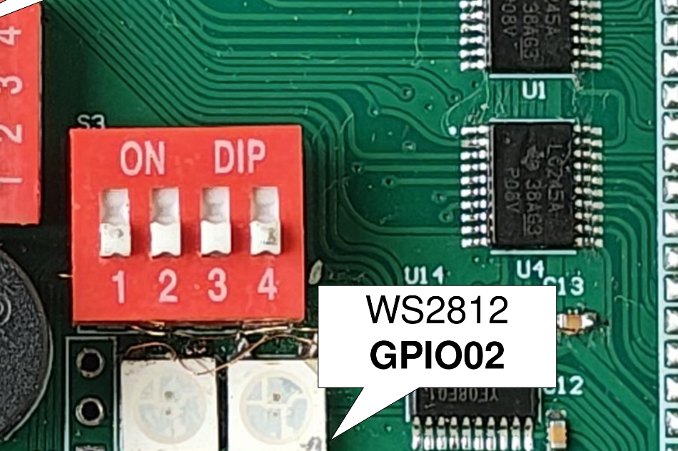
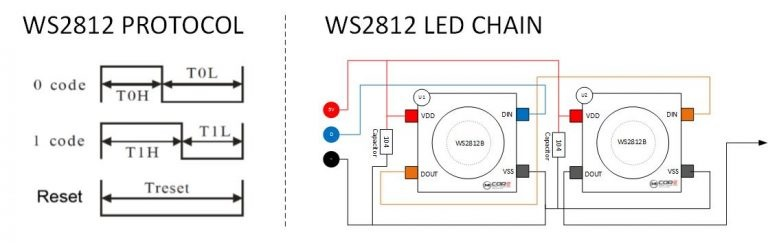

***************************************************************
Project 12 : RGB Mood Lamp — Five Light Effects with One Button
***************************************************************

Introduction
============

In this project, you will turn the single WS2812B RGB LED on the STEAM development board into a **mood lamp**: a light source that cycles through five distinct visual effects, each selectable by pressing the on-board button. Along the way, you will learn how a single LED can express a wide range of colour, brightness, and animation techniques — and discover why the HSV colour model is far more useful for creative LED work than raw RGB values.

By the end of this tutorial, you will know how to:

* Control a WS2812B LED using the FastLED library.
* Understand the difference between the RGB and HSV colour models.
* Implement multiple light effects (solid colour, breathing, rainbow cycle, fire flicker, and police strobe) using FastLED's built-in tools.
* Use a single button to cycle between named program modes.
* Apply non-blocking timing techniques so animations run smoothly without ``delay()``.

Requirements
============

Before starting, make sure you have the following:

* The STEAM development kit or The STEAM standalone microcontroller board
* USB cable
* Arduino IDE with ESP32 toolchain installed

All components — the WS2812B LED and the push button — are already integrated on the STEAM development board. No external components are needed.

   The interfacing description of the microcontroller board

**Pin assignments used in this project:**

.. list-table::
   :header-rows: 1
   :widths: 30 20 50

   * - Signal
     - ESP32-S3 GPIO
     - Description
   * - WS2812B Data
     - IO2
     - Single-wire serial data to the LED
   * - Button
     - IO0
     - Mode select button, reads LOW when pressed

.. note::
   The button reads logic **LOW** when pressed (active LOW with internal pull-up). The WS2812B data line requires no external resistor or pull-up — it is driven directly by the GPIO output.

Background: Key Concepts
=========================

The WS2812B LED
----------------

The WS2812B is an RGB LED with an integrated control circuit inside its package. Instead of three separate wires for red, green, and blue, it uses a **single serial data wire** and a strict one-wire timing protocol. Each WS2812B contains shift registers and drivers that decode the incoming serial stream and set the brightness of each colour channel independently using pulse-width modulation (PWM).

This single-wire protocol makes it easy to **daisy-chain** multiple LEDs: the output of one feeds the input of the next, and each LED peels off the first 24 bits it receives (8 bits per channel in GRB order) and forwards the rest downstream. The STEAM board has two WS2812Bs, and an daisy-chain 3 header for whole strip extension.

   WS2812B internal block diagram showing the integrated driver and RGB die

The GRB Colour Order
----------------------

Unlike most RGB devices, the WS2812B sends colour data in **Green → Red → Blue** order (GRB), not the more intuitive RGB order. The FastLED library handles this automatically when you declare the chipset as ``WS2812B`` with the ``GRB`` colour order template parameter — you always write colours as (R, G, B) in your code and FastLED reorders the bytes before transmitting.

RGB vs. HSV: Choosing the Right Colour Model
----------------------------------------------

There are two common ways to describe a colour in software:

**RGB (Red, Green, Blue)** specifies colour by mixing amounts of three primary lights. It is simple to understand but awkward for creative work: to smoothly sweep from red to blue, you would need to decrease R, keep G at zero, and increase B simultaneously — and the arithmetic quickly becomes messy.

**HSV (Hue, Saturation, Value)** separates colour into three more intuitive properties:

.. list-table::
   :header-rows: 1
   :widths: 20 40 40

   * - Component
     - Meaning
     - Range in FastLED
   * - Hue
     - The colour itself — its position on the colour wheel
     - 0–255 (0 = red, 64 = yellow, 96 = green, 160 = blue, 192 = purple)
   * - Saturation
     - How vivid or washed-out the colour is
     - 0 = white, 255 = fully saturated pure colour
   * - Value
     - Brightness
     - 0 = off (black), 255 = maximum brightness

With HSV, creating a smooth rainbow sweep is trivial: simply increment the hue from 0 to 255. Creating a breathing effect is equally simple: oscillate the value. FastLED represents HSV colours with the ``CHSV`` type and converts to RGB automatically when you assign to a ``CRGB`` LED element.

.. note::
   FastLED uses a **0–255 range for all three components**, not the conventional 0–360° for hue. This is intentional: byte-sized values are faster to compute and store on embedded processors. The hue also uses FastLED's "rainbow" mapping, which spreads yellow and orange more evenly than a mathematically straight spectrum.

Non-Blocking Animation with ``millis()``
------------------------------------------

Earlier projects used ``delay()`` to control timing. For animations, ``delay()`` is problematic because it stops the CPU completely — the button cannot be read while the delay is running.

The correct approach is to track the last time an update occurred using ``millis()`` (the number of milliseconds since boot) and check whether enough time has elapsed before advancing the animation. The CPU is free between updates to check the button and perform other tasks.

.. code-block:: cpp

   unsigned long now = millis();
   if (now - lastUpdate >= INTERVAL_MS) {
       lastUpdate = now;
       // advance animation one step
   }

The Five Mood Effects
----------------------
This project implements five named light effects, each teaching a different FastLED concept:

.. list-table::
   :header-rows: 1
   :widths: 5 20 75

   * - #
     - Name
     - Description
   * - 1
     - **Calm — Solid HSV**
     - A single steady colour. Press the button to advance through eight equally-spaced hues around the colour wheel.
   * - 2
     - **Breathe — Pulse**
     - The LED slowly fades in and out on a sinusoidal curve, simulating the rhythm of calm breathing.
   * - 3
     - **Flow — Rainbow Cycle**
     - The hue advances continuously around the colour wheel, producing a slow, hypnotic colour sweep.
   * - 4
     - **Flicker — Fire**
     - The LED simulates a candle flame with randomised orange-red tones and rapid brightness variation.
   * - 5
     - **Alert — Strobe**
     - The LED alternates between red and blue in a rapid two-beat pattern, similar to an emergency light.

Required Library
================

Install the FastLED library through the Arduino Library Manager (**Tools → Manage Libraries**):

Search for **FastLED** and install the library by Daniel Garcia / FastLED. Version **3.7.x** is recommended for the ESP32-S3; see the note below.

.. note::
   FastLED version 3.10+ has known compatibility issues with some ESP32 Arduino core versions and the I²S peripheral used for WS2812B output. If you experience random flickering or incorrect colours, downgrade to version **3.7.8** using the Library Manager's version selector. The API is identical between these versions.

Writing the Program
===================

Create a new sketch in the Arduino IDE and enter the following code:

.. code-block:: cpp

   #include <FastLED.h>

   // ── Hardware ────────────────────────────────────────────────────────────────
   #define LED_PIN    2      // WS2812B data line
   #define NUM_LEDS   1      // One on-board LED
   #define BUT_PIN    0      // Mode button (active LOW, pull-up)
   #define BRIGHTNESS 80     // Global brightness 0–255 (keep below 150 for single USB power)

   CRGB leds[NUM_LEDS];

   // ── Mode definitions ────────────────────────────────────────────────────────
   enum Mode {
       MODE_CALM    = 0,   // Solid colour, advances hue on each press
       MODE_BREATHE = 1,   // Sinusoidal brightness pulse
       MODE_FLOW    = 2,   // Continuous hue rotation
       MODE_FLICKER = 3,   // Candle fire simulation
       MODE_ALERT   = 4,   // Red/blue emergency strobe
       MODE_COUNT   = 5    // Total number of modes (keep last)
   };

   // Mode names for Serial logging
   const char* MODE_NAMES[] = {
       "CALM — Solid",
       "BREATHE — Pulse",
       "FLOW — Rainbow",
       "FLICKER — Fire",
       "ALERT — Strobe"
   };

   // ── State ────────────────────────────────────────────────────────────────────
   Mode         currentMode  = MODE_CALM;
   uint8_t      calmHue      = 0;       // Hue index for CALM mode (0–7 × 32)
   uint8_t      flowHue      = 0;       // Running hue for FLOW mode
   unsigned long lastUpdate  = 0;       // Last animation tick timestamp
   unsigned long lastButton  = 0;       // Last button-press timestamp (debounce)
   bool         lastBtnState = HIGH;    // Previous button reading

   // ── Button handler: advance mode on falling edge ──────────────────────────
   void checkButton() {
       bool state = digitalRead(BUT_PIN);
       unsigned long now = millis();

       // Falling edge (HIGH → LOW) + 50 ms debounce guard
       if (lastBtnState == HIGH && state == LOW && (now - lastButton) > 50) {
           lastButton = now;

           if (currentMode == MODE_CALM) {
               // In CALM mode, first cycle through 8 hues before switching mode
               calmHue += 32;   // 256 / 32 = 8 steps around the wheel
               if (calmHue == 0) {
                   // Wrapped all the way around — now advance to next mode
                   currentMode = (Mode)((currentMode + 1) % MODE_COUNT);
               }
           } else {
               currentMode = (Mode)((currentMode + 1) % MODE_COUNT);
           }

           Serial.print(F("Mode → "));
           Serial.println(MODE_NAMES[currentMode]);
       }
       lastBtnState = state;
   }

   // ── Effect 1: CALM — Solid HSV colour ─────────────────────────────────────
   // Shows a single fully saturated, fully bright colour.
   // The hue is stored in calmHue and advanced by the button handler.
   void effectCalm() {
       leds[0] = CHSV(calmHue, 255, 255);
       FastLED.show();
   }

   // ── Effect 2: BREATHE — Sinusoidal brightness pulse ───────────────────────
   // beatsin8(bpm, low, high) returns a value oscillating between low and high
   // at the given BPM using a sine wave. No millis() bookkeeping needed.
   void effectBreathe() {
       uint8_t brightness = beatsin8(12, 20, 255);   // 12 BPM, range 20–255
       leds[0] = CHSV(160, 200, brightness);          // Calm blue hue
       FastLED.show();
   }

   // ── Effect 3: FLOW — Continuous hue rotation ──────────────────────────────
   // Advances the hue by 1 every 30 ms, completing a full circle in ~8 seconds.
   void effectFlow() {
       unsigned long now = millis();
       if (now - lastUpdate >= 30) {
           lastUpdate = now;
           flowHue++;               // Wraps at 256 automatically (uint8_t overflow)
       }
       leds[0] = CHSV(flowHue, 240, 255);
       FastLED.show();
   }

   // ── Effect 4: FLICKER — Candle fire simulation ────────────────────────────
   // A candle flame is orange-red with rapid, irregular brightness variation.
   // random8() from FastLED is a fast 8-bit random number generator.
   void effectFlicker() {
       unsigned long now = millis();
       if (now - lastUpdate >= random8(20, 80)) {   // Random update interval 20–80 ms
           lastUpdate = now;
           uint8_t flicker = random8(140, 255);      // Random brightness
           uint8_t flameHue = random8(0, 25);        // Red-to-orange hue range
           leds[0] = CHSV(flameHue, 255, flicker);
           FastLED.show();
       }
   }

   // ── Effect 5: ALERT — Red/Blue emergency strobe ───────────────────────────
   // Alternates red and blue at 4 Hz (250 ms per phase).
   void effectAlert() {
       unsigned long now = millis();
       if (now - lastUpdate >= 250) {
           lastUpdate = now;
           static bool phase = false;
           phase = !phase;
           leds[0] = phase ? CRGB::Red : CRGB::Blue;
           FastLED.show();
       }
   }

   // ── Setup ──────────────────────────────────────────────────────────────────
   void setup() {
       Serial.begin(115200);
       pinMode(BUT_PIN, INPUT_PULLUP);

       FastLED.addLeds<WS2812B, LED_PIN, GRB>(leds, NUM_LEDS);
       FastLED.setBrightness(BRIGHTNESS);
       FastLED.clear();
       FastLED.show();   // Ensure LED starts OFF

       Serial.println(F("STEAM RGB Mood Lamp ready."));
       Serial.print(F("Mode → "));
       Serial.println(MODE_NAMES[currentMode]);
   }

   // ── Loop ───────────────────────────────────────────────────────────────────
   void loop() {
       checkButton();

       switch (currentMode) {
           case MODE_CALM:    effectCalm();    break;
           case MODE_BREATHE: effectBreathe(); break;
           case MODE_FLOW:    effectFlow();    break;
           case MODE_FLICKER: effectFlicker(); break;
           case MODE_ALERT:   effectAlert();   break;
       }
   }

Uploading the Program
=====================

1. Connect the board to your computer using the USB cable.
2. Open the Arduino IDE.
3. Select **ESP32S3 Dev Module** from **Tools → Board → esp32**.
4. Select the correct serial port from **Tools → Port**.
5. Click the **Upload** button and wait for completion.
6. Open the **Serial Monitor** (Tools → Serial Monitor, baud 115200) to see the current mode name printed each time the button is pressed.

.. figure:: ../../img/ws2812b_effects.png
   :align: center
   :figclass: align-center

Expected Result
===============

After uploading the program, the LED starts in **CALM** mode, showing a red colour at full brightness. From there:

* **Pressing the button** in CALM mode cycles through eight colours: red → orange → yellow → green → cyan → blue → purple → pink → red. After a full colour wheel pass, the next press switches to BREATHE mode.
* **BREATHE mode** pulses the LED slowly in and out in calm blue, like a sleeping laptop indicator light.
* **Pressing again** switches to FLOW mode: the colour sweeps continuously around the colour wheel in about eight seconds per full cycle.
* **Pressing again** switches to FLICKER: the LED mimics a candle flame, with random orange-red flashes at irregular intervals.
* **Pressing again** switches to ALERT: the LED flashes red–blue alternately at 4 Hz.
* **One more press** returns to CALM mode and the cycle begins again.

Mode changes are printed to the Serial Monitor with the mode name, which is useful for logging and debugging.

How the Code Works
==================

**FastLED Initialisation**

.. code-block:: cpp

   FastLED.addLeds<WS2812B, LED_PIN, GRB>(leds, NUM_LEDS);
   FastLED.setBrightness(BRIGHTNESS);

``addLeds<>`` is a template function that takes three compile-time parameters: the chipset type, the data pin, and the colour order. It connects the ``leds[]`` array to the WS2812B protocol driver. ``setBrightness()`` applies a global scale factor to all colours before they are transmitted — this is the correct way to dim the LED without altering the colours stored in the array.

.. note::
   ``FastLED.setBrightness(80)`` means all colour channels are scaled to 80/255 ≈ 31% of their declared value. This keeps current consumption well within the USB power budget of the development board. A single WS2812B at full white draws approximately 60 mA; at brightness 80 it draws around 19 mA.

**The CHSV Type**

``CHSV(hue, saturation, value)`` creates a colour in HSV space. When you assign it to a ``CRGB`` array element, FastLED automatically converts it using its rainbow colour map:

.. code-block:: cpp

   leds[0] = CHSV(calmHue, 255, 255);   // Pure, fully bright colour at hue 'calmHue'
   leds[0] = CHSV(160, 200, brightness); // Blue, slightly desaturated, variable brightness

This automatic conversion means you never need to call a separate conversion function — the assignment operator handles it.

**beatsin8() for Breathing**

``beatsin8(bpm, low, high)`` is a FastLED utility that returns a sine-wave oscillating value without any state variables or explicit timing code:

.. code-block:: cpp

   uint8_t brightness = beatsin8(12, 20, 255);

At 12 BPM the value completes one full sine cycle in five seconds — similar to the breathing rate of a person at rest. The minimum value of 20 ensures the LED never fully extinguishes, maintaining a faint glow at the lowest point.

**Non-blocking Timing in FLOW and FLICKER**

The FLOW and FLICKER effects use ``millis()`` to advance their state:

.. code-block:: cpp

   unsigned long now = millis();
   if (now - lastUpdate >= 30) {
       lastUpdate = now;
       flowHue++;
   }

Using subtraction (``now - lastUpdate``) rather than a comparison like ``millis() >= lastUpdate + 30`` makes the timing robust against the 49-day overflow of ``millis()`` back to zero. In the FLICKER effect, the interval itself is randomised (``random8(20, 80)``) to prevent the regular periodic appearance that would break the illusion of a real flame.

**Mode Cycling Logic**

The button handler uses edge detection (monitoring the transition from HIGH to LOW) and a 50 ms debounce guard:

.. code-block:: cpp

   if (lastBtnState == HIGH && state == LOW && (now - lastButton) > 50) {

In CALM mode specifically, the button first steps through the eight hues before advancing to the next mode. This makes the button multi-function: within CALM mode it is a colour selector; at the end of the hue cycle it becomes a mode switcher. The ``calmHue`` wraps at 256 (natural ``uint8_t`` overflow), and when it has wrapped back to 0, a full revolution has been completed.

**The switch Statement**

The main ``loop()`` uses a ``switch`` on the current mode to dispatch to the appropriate effect function. Each effect function is responsible only for its own timing and LED update — the loop itself remains unconditionally fast, ensuring the button check ``checkButton()`` runs on every iteration.

Effect Reference Table
======================

.. list-table::
   :header-rows: 1
   :widths: 18 18 20 44

   * - Mode
     - Colour Tool
     - Timing
     - Key FastLED Feature Used
   * - CALM
     - ``CHSV``
     - On button press only
     - HSV colour model; hue mapping
   * - BREATHE
     - ``CHSV`` with variable V
     - ``beatsin8()`` — self-clocking
     - Built-in oscillator function; no state variables
   * - FLOW
     - ``CHSV`` with rolling H
     - ``millis()`` every 30 ms
     - ``uint8_t`` hue overflow as free modulo
   * - FLICKER
     - ``CHSV`` warm hues
     - ``millis()`` every 20–80 ms (random)
     - ``random8()``; irregular timing for realism
   * - ALERT
     - ``CRGB::Red`` / ``CRGB::Blue``
     - ``millis()`` every 250 ms
     - Named ``CRGB`` colour constants; static local variable

Experiment
==========

Try the following modifications to explore FastLED further.

* **Change the BREATHE hue** to match a mood. Try ``CHSV(96, 255, brightness)`` for green, ``CHSV(0, 200, brightness)`` for warm red, or ``CHSV(64, 180, brightness)`` for amber. Observe how desaturating (reducing saturation below 255) shifts the colour towards white.

* **Speed up or slow down the FLOW effect** by changing the millisecond interval. A value of ``5`` produces a rapid colour spin; ``100`` gives a very slow, meditative sweep. Try linking the speed to an expression involving ``millis()``:

  .. code-block:: cpp

     // Gradually accelerates over 10 seconds, then resets
     uint8_t speed = (millis() / 100) % 30 + 5;
     if (now - lastUpdate >= speed) { ... }

* **Add a CALM colour name** to the Serial Monitor output so you can see which colour is currently displayed:

  .. code-block:: cpp

     const char* HUE_NAMES[] = {
         "Red", "Orange", "Yellow", "Green",
         "Cyan", "Blue", "Purple", "Pink"
     };
     Serial.println(HUE_NAMES[(calmHue / 32) % 8]);

* **Add a second FLOW mode** at a different saturation to produce a pastel rainbow:

  .. code-block:: cpp

     leds[0] = CHSV(flowHue, 128, 255);   // Saturation 128 = soft pastel colours

* **Combine effects** by using two concurrent oscillators. For example, in a new OCEAN mode, oscillate both hue and brightness independently:

  .. code-block:: cpp

     uint8_t h = beatsin8(3, 140, 180);   // Hue swings between sea-blue and teal
     uint8_t v = beatsin8(7, 60, 255);    // Brightness pulses at a different rate
     leds[0] = CHSV(h, 220, v);

* **Map button hold-time to brightness**: detect how long the button is held and use that duration to set ``FastLED.setBrightness()``:

  .. code-block:: cpp

     if (state == LOW) {
         unsigned long held = millis() - lastButton;
         FastLED.setBrightness(constrain(held / 10, 20, 255));
         FastLED.show();
     }

Troubleshooting
===============

.. list-table::
   :header-rows: 1
   :widths: 35 65

   * - Symptom
     - What to check
   * - LED stays off after upload
     - Confirm FastLED is installed. Verify ``LED_PIN`` is set to ``2``. Open the Serial Monitor to check for startup messages.
   * - LED shows wrong colours (e.g. red appears green)
     - The colour order may be wrong. Try replacing ``GRB`` with ``RGB`` in the ``addLeds<>`` template parameter. WS2812B clones sometimes use different orders.
   * - LED flickers randomly in all modes
     - This is a known FastLED issue with some ESP32 core 3.10+ versions. Downgrade FastLED to version **3.7.8** via the Library Manager.
   * - Button does not change mode / changes mode erratically
     - The 50 ms debounce guard is too short for some buttons. Increase it to ``100`` ms. Confirm ``BUT_PIN`` is set to ``0`` and ``INPUT_PULLUP`` is configured.
   * - ALERT strobe appears at wrong rate
     - Confirm no ``delay()`` calls are left in the code. Check that ``lastUpdate`` is declared globally, not inside the effect function (a local static would work but reset on mode change).
   * - LED is much dimmer than expected
     - ``FastLED.setBrightness(BRIGHTNESS)`` scales all output. Increase the ``BRIGHTNESS`` constant. For standalone USB power, keep it below 200 (to stay within ~45 mA per LED at white).

Summary
=======

In this project you built a five-mode mood lamp controlled by a single button, using the WS2812B RGB LED and the FastLED library. Each mode demonstrated a distinct animation technique, from a simple solid colour to a stochastic fire simulation.

Key concepts covered include:

* Driving a WS2812B with ``FastLED.addLeds<WS2812B, PIN, GRB>()``.
* The **GRB colour order** of the WS2812B and how FastLED handles it transparently.
* The **HSV colour model** (``CHSV``) and why it is more natural for creative LED work than raw RGB.
* **FastLED's 0–255 rainbow hue space** and the hue values for common colours.
* **``beatsin8()``** for effortless sinusoidal oscillation without manual timing.
* **``random8()``** for fast, 8-bit random values in animation.
* **``millis()``-based non-blocking timing** to keep the button responsive during animations.
* Button **edge detection and debouncing** for reliable single-event triggering.
* Using an **enum** and a ``switch`` statement to structure multi-mode firmware cleanly.

The patterns introduced here — HSV colour sweeps, sinusoidal breathing, non-blocking millis timing, randomised updates, and mode state machines — appear in almost every real-world LED project and are directly transferable to strips of hundreds of LEDs, not just a single light.