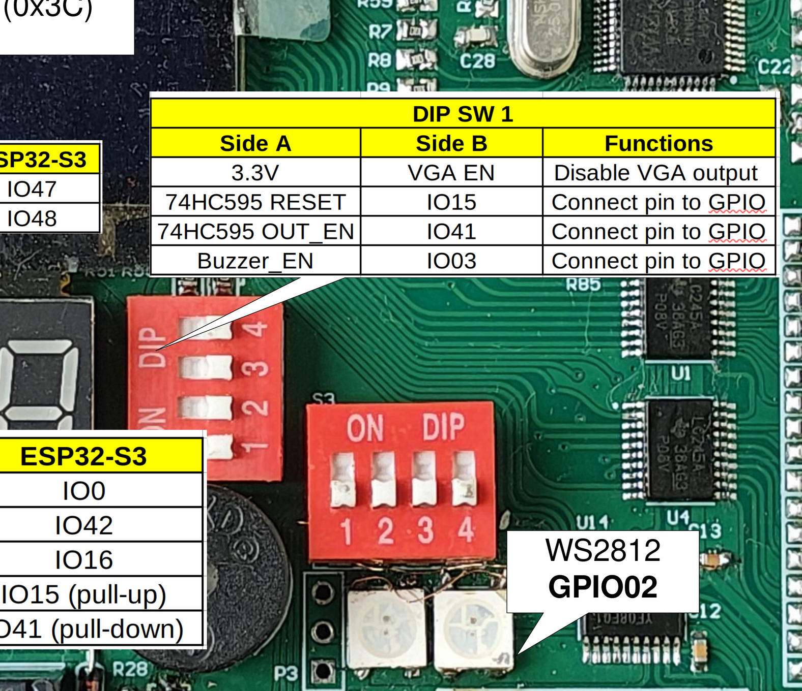
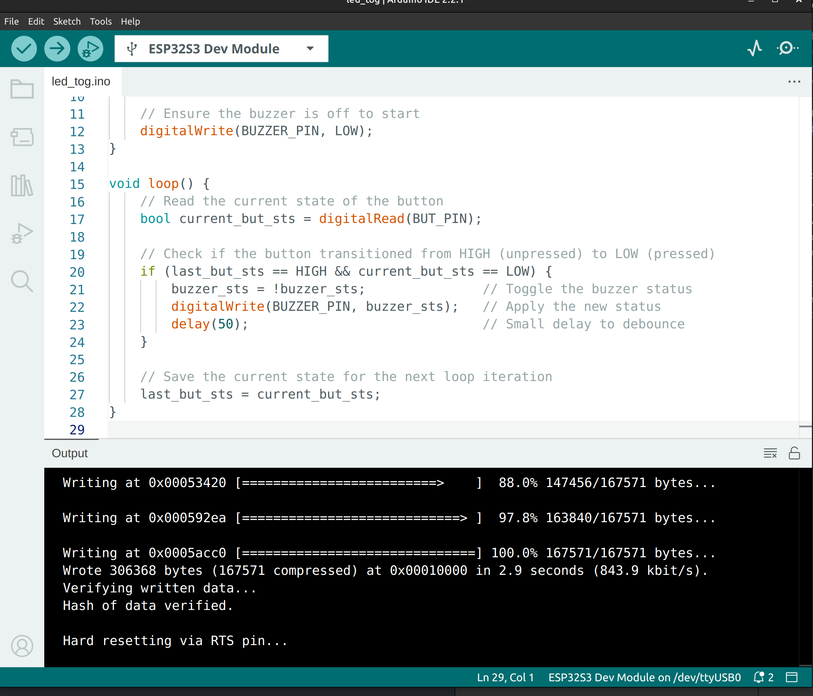

*************************************************************
Project 3 : Turn ON and OFF the Buzzer using a button 
*************************************************************

Introduction
============ 

In this project, we will learn how to turn an active buzzer ON and OFF using a button. Unlike a simple delay-based toggle, we will improve our programming logic by introducing **Edge Detection** (also known as State Change Detection). By the end of this tutorial, you will know how to:

* Control an active buzzer using digital output.
* Understand active-LOW button logic.
* Implement edge detection so the buzzer only toggles once per press, regardless of how long the button is held down.

Requirements
============

Before starting, make sure you have the following:

* The STEAM development kit or The STEAM standalone microcontroller board 
* USB cable
* Arduino IDE with ESP32 toolchain installed

In this project, the built-in buzzer and button will be used. No external components are required.

   The interfacing description of the microcontroller board 

For buzzer it also need to change the dips switch 1 position as follow:

   .. figure:: ../../img/buzz_ON.png
      :align: center
      :width: 200
      :figclass: align-center

      DIP switch 1 position for enabling Buzzer 
The built-in buzzer on **GPIO03** and the button on **GPIO0** will be used. *(Note: Ensure GPIO09 matches your specific board's buzzer pin)*.

.. note::
    The button on this board is active-LOW. This means it reads as HIGH when left alone, and drops to LOW when pressed.

Writing the Program
===================

Create a new sketch in the Arduino IDE and enter the following code:

.. code-block:: cpp

    #define BUZZER_PIN 3
    #define BUT_PIN 0

    bool buzzer_sts = false;
    bool last_but_sts = HIGH; 

    void setup() {
        pinMode(BUZZER_PIN, OUTPUT);
        pinMode(BUT_PIN, INPUT);
        
        // Ensure the buzzer is off to start
        digitalWrite(BUZZER_PIN, LOW);
    }

    void loop() {
        // Read the current state of the button
        bool current_but_sts = digitalRead(BUT_PIN);

        // Check if the button transitioned from HIGH (unpressed) to LOW (pressed)
        if (last_but_sts == HIGH && current_but_sts == LOW) {
            buzzer_sts = !buzzer_sts;               // Toggle the buzzer status
            digitalWrite(BUZZER_PIN, buzzer_sts);   // Apply the new status
            delay(50);                              // Small delay to debounce
        }
        
        // Save the current state for the next loop iteration
        last_but_sts = current_but_sts;
    }

Uploading the Program
^^^^^^^^^^^^^^^^^^^^^

1. Connect the Arduino board to your computer using the USB cable.
2. Open the Arduino IDE.
3. Select **ESP32S3 Dev Module** from **Tools → Board → esp32**.
4. Select the correct serial port obtained when the board is connected to the computer from **Tools → Port**.
5. Click the **Upload** button.
6. Wait until the upload is complete.

Expected Result
^^^^^^^^^^^^^^^

After uploading the program to the Arduino board:

* The buzzer is initially **silent**.
* Pressing and releasing the button will turn the buzzer **ON**.
* Pressing the button a second time will turn the buzzer **OFF**.
* Unlike simple delay loops, holding the button down will *not* cause the buzzer to continuously turn on and off. It waits for a fresh button press.

How the Code Works
^^^^^^^^^^^^^^^^^^
**`setup()`**

The `setup()` function runs once when the Arduino starts.

.. code-block:: cpp

    pinMode(BUZZER_PIN, OUTPUT);
    pinMode(BUT_PIN, INPUT);
    digitalWrite(BUZZER_PIN, LOW);

* `BUZZER_PIN` is configured as an output to drive the buzzer.
* `BUT_PIN` is configured as an input to read the push button.
* We explicitly write a `LOW` signal to the buzzer to ensure it starts silently.

`loop()`

The `loop()` function executes continuously. We begin by reading the button:

.. code-block:: cpp

    bool current_but_sts = digitalRead(BUT_PIN);

Next, we check for a **State Change** (specifically a falling edge). Because the button is active-LOW, a press means the signal drops from `HIGH` to `LOW`.

.. code-block:: cpp

    if (last_but_sts == HIGH && current_but_sts == LOW) {
        buzzer_sts = !buzzer_sts;
        digitalWrite(BUZZER_PIN, buzzer_sts);
        delay(50);
    }

If the last state was `HIGH` and the current state is `LOW`, we know a *new* press just occurred. We invert `buzzer_sts` and write it to the buzzer. The `delay(50)` provides just enough time to ignore the mechanical bouncing of the button contacts without slowing down the rest of our code.

Finally, we update our tracking variable:

.. code-block:: cpp

    last_but_sts = current_but_sts;

This ensures that on the next loop, the program remembers the button is already being held down, preventing accidental double-toggles.

Experiment
^^^^^^^^^^

Try modifying the program to better understand how it works:

* **Momentary Switch:** Remove the toggle logic entirely so the buzzer only makes noise *while* you are actively holding the button down. (Hint: write the inverted `current_but_sts` directly to the buzzer).
* **Double Press:** Can you modify the logic to only turn the buzzer on if you press the button twice within one second?

Summary
=======
In this tutorial, you learned how to use a push button to control an active buzzer. Rather than relying on long, blocking delays, you implemented **state change detection**. By comparing the button's current state to its previous state, the microcontroller can detect the exact moment a button is pressed down.

Key concepts covered include:

* Controlling an active buzzer using **digitalWrite()**.
* Understanding active-LOW hardware logic.
* Using state change detection (edge detection) to trigger events exactly once per action.
* Applying a short 50 ms delay for effective software debouncing.

This project introduces vital logic used in professional embedded systems, ensuring user interfaces respond crisply and accurately without unexpected repeating behaviors.

