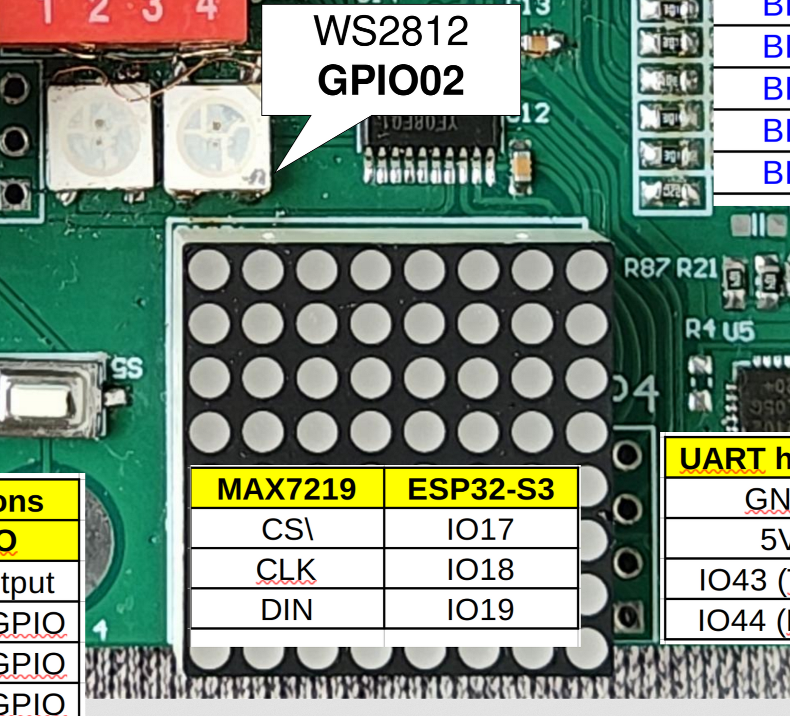
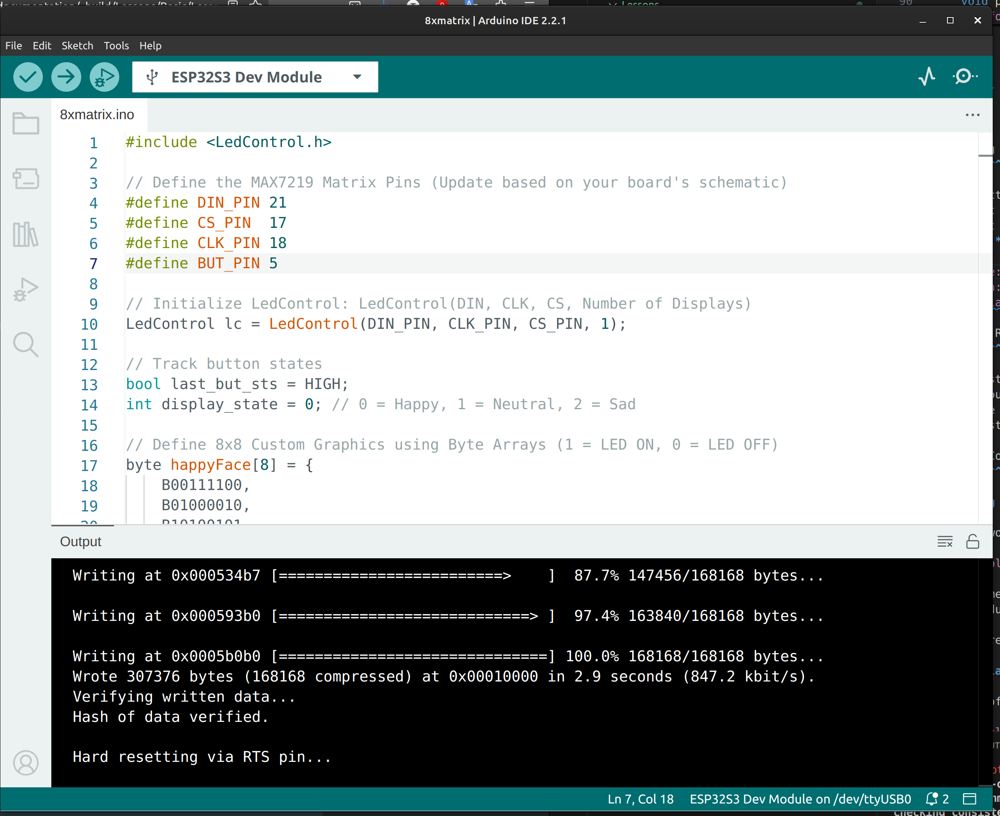

*************************************************************
Project 5 : Control an 8x8 LED Matrix Display using a Button
*************************************************************

Introduction
============ 

In this project, we will learn how to control an 8x8 LED Matrix display using the integrated **MAX7219** LED driver chip. Controlling 64 individual LEDs normally requires a massive amount of microcontroller pins, but the MAX7219 allows us to control the entire matrix using just 3 digital communication pins. 

We will use our button edge-detection logic to cycle through three different pixel-art expressions (Happy, Neutral, and Sad) on the matrix with each press.

By the end of this tutorial, you will know how to:

* Interface with the MAX7219 LED driver using a library.
* Represent visual graphics as binary data arrays.
* Cycle through multiple display states using a single button event.

Requirements
============

Before starting, make sure you have the following:

* The STEAM development kit or The STEAM standalone microcontroller board 
* USB cable
* Arduino IDE with ESP32 toolchain installed
* **LedControl** library installed (Go to **Tools → Manage Libraries**, search for "LedControl" by Eberhard Fahle, and install it).

In this project, the built-in 8x8 LED Matrix and button will be used. No external components are required.

   The interfacing description of the 8x8 matrix 

The built-in button is on **GPIO0**. The MAX7219 driver typically uses three pins: Data In (DIN), Clock (CLK), and Chip Select (CS). 

.. note::
    Check your specific STEAM board documentation for the exact GPIO pin numbers assigned to the matrix **DIN**, **CLK**, and **CS** pins and update the code macros below if necessary.

Writing the Program
===================

Create a new sketch in the Arduino IDE and enter the following code:

.. code-block:: cpp

    #include <LedControl.h>

    // Define the MAX7219 Matrix Pins (Update based on your board's schematic)
    #define DIN_PIN 11
    #define CS_PIN  10
    #define CLK_PIN 12
    #define BUT_PIN 0

    // Initialize LedControl: LedControl(DIN, CLK, CS, Number of Displays)
    LedControl lc = LedControl(DIN_PIN, CLK_PIN, CS_PIN, 1);

    // Track button states
    bool last_but_sts = HIGH; 
    int display_state = 0; // 0 = Happy, 1 = Neutral, 2 = Sad

    // Define 8x8 Custom Graphics using Byte Arrays (1 = LED ON, 0 = LED OFF)
    byte happyFace[8] = {
        B00111100,
        B01000010,
        B10100101,
        B10000001,
        B10100101,
        B10011001,
        B01000010,
        B00111100
    };

    byte neutralFace[8] = {
        B00111100,
        B01000010,
        B10100101,
        B10000001,
        B10111101,
        B10000001,
        B01000010,
        B00111100
    };

    byte sadFace[8] = {
        B00111100,
        B01000010,
        B10100101,
        B10000001,
        B10011001,
        B10100101,
        B01000010,
        B00111100
    };

    void setup() {
        // Wake up the MAX7219 from power-saving/shutdown mode
        lc.shutdown(0, false);
        
        // Set brightness intensity (0 is dimmest, 15 is brightest)
        lc.setIntensity(0, 4);
        
        // Clear the display screen
        lc.clearDisplay(0);
        
        // Configure the button pin
        pinMode(BUT_PIN, INPUT);
        
        // Show the initial happy face
        drawFace(happyFace);
    }

    void loop() {
        // Read the current state of the active-LOW button
        bool current_but_sts = digitalRead(BUT_PIN);

        // Detect button press (falling edge: HIGH to LOW transition)
        if (last_but_sts == HIGH && current_but_sts == LOW) {
            
            // Move to the next face state (0 -> 1 -> 2 -> 0)
            display_state = (display_state + 1) % 3;

            // Update display based on the new state
            if (display_state == 0) {
                drawFace(happyFace);
            } else if (display_state == 1) {
                drawFace(neutralFace);
            } else if (display_state == 2) {
                drawFace(sadFace);
            }
            
            delay(50); // Small debounce delay
        }
        
        // Save the state for the next loop iteration
        last_but_sts = current_but_sts;
    }

    // Helper function to render a byte array to the matrix
    void drawFace(byte face[]) {
        for (int row = 0; row < 8; row++) {
            lc.setRow(0, row, face[row]);
        }
    }

Uploading the Program
^^^^^^^^^^^^^^^^^^^^^

1. Connect the board to your computer using the USB cable.
2. Open the Arduino IDE.
3. Ensure the **LedControl** library is installed via the Library Manager.
4. Select your board module and the correct serial port from the **Tools** menu.
5. Click the **Upload** button.

Expected Result
^^^^^^^^^^^^^^^

After uploading the program:

* The 8x8 LED Matrix will immediately display a smiling face emoji.
* Press the push button once; the smile transforms into a flat, neutral expression.
* Press the button a second time; the expression changes to a sad face.
* Pressing it a third time cycles the loop back, returning the display to a happy face.

.. figure:: ../../img/8x8matrix.gif
   :align: center
   :figclass: align-center

How the Code Works
^^^^^^^^^^^^^^^^^^

**Understanding Byte Arrays for Graphics**

An 8x8 matrix consists of 8 rows and 8 columns. We represent this grid using an array of 8 bytes. Because a single byte consists of 8 bits, each bit matches perfectly with an individual LED in that row:

.. code-block:: cpp

    byte happyFace[8] = {
        B00111100, // Row 0: Only the middle 4 LEDs are ON
        B01000010, // Row 1
        ...
    };

A `1` turns the corresponding pixel ON, while a `0` keeps it OFF. This allows you to paint pixel art directly in text using binary (`B`) syntax!

**The `LedControl` Setup**

Inside `setup()`, we initialize the MAX7219 controller:

.. code-block:: cpp

    lc.shutdown(0, false);
    lc.setIntensity(0, 4);
    lc.clearDisplay(0);

By default, the MAX7219 boots up in "sleep mode" to save power. `shutdown(0, false)` wakes up display index `0`. We then scale the brightness down to `4` so it doesn't hurt our eyes, and clear out any random artifact data from the screen.

**Cycling States with Modulo Logic**

To change faces smoothly without creating massive `if-else` blocks, we use the modulo operator (`%`):

.. code-block:: cpp

    display_state = (display_state + 1) % 3;

This neat math trick forces `display_state` to step forward incrementally, but reset automatically back to `0` whenever it hits `3`, creating a clean, perpetual loop.

Experiment
^^^^^^^^^^

* **Create Your Own Icon:** Rewrite one of the byte arrays to display a different icon, such as a heart, a checkbox, or an arrow indicator.
* **Adjust Brightness Dynamically:** Modify the logic so that instead of changing faces, pressing the button steps the display brightness (`lc.setIntensity`) up from 0 to 15, then rolls back to 0.

Summary
=======
In this tutorial, you learned how to command an 8x8 LED Matrix using a MAX7219 driver chip. You bypassed complex multiplexing wiring by leveraging a dedicated hardware driver and the `LedControl` library.

Key concepts covered include:

* Initializing and configuring external drivers like the MAX7219.
* Mapping 2D pixel grids using 1D byte arrays and binary literals.
* Utilizing helper functions (`drawFace`) to keep loops highly organized.
* Using mathematical constraints (the modulo operator) to loop sequence indexes cleanly.