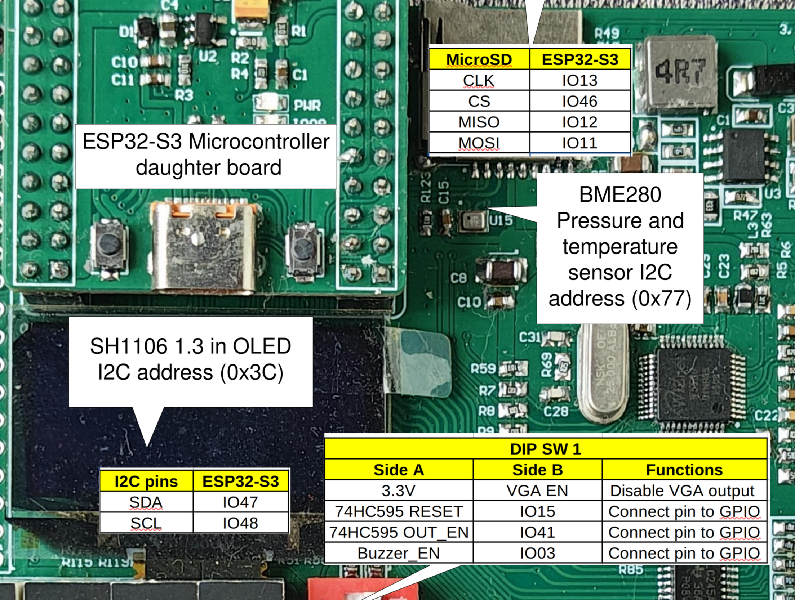
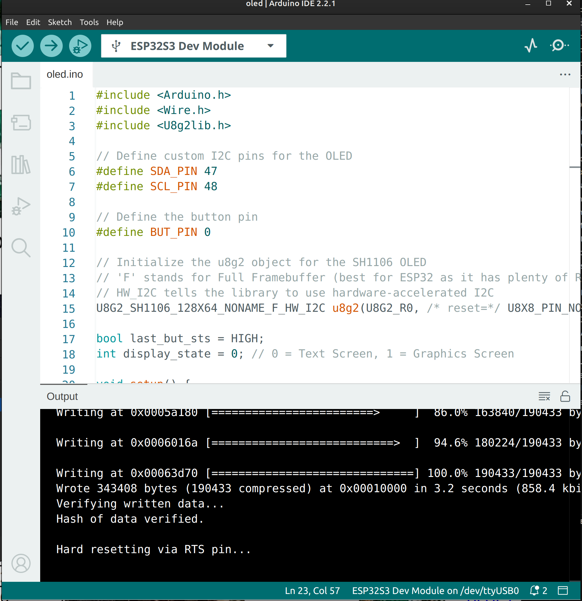

*************************************************************
Project 6 : Display Text and Graphics on an SH1106 OLED
*************************************************************

Introduction
============ 

In this project, we will learn how to operate a high-resolution, self-illuminating display: the **SH1106 OLED**. Unlike the 8x8 LED matrix that is great for blocky pixel art, an OLED screen can display crisp text, variable fonts, and smooth geometric shapes.

We will communicate with the screen using **I2C** (Inter-Integrated Circuit), a protocol that requires only two data wires. To make drawing easy, we will use the highly versatile **u8g2** graphics library. By the end of this tutorial, you will know how to:

* Reassign hardware I2C pins (SDA and SCL) on the ESP32.
* Initialize the u8g2 library for an SH1106 display.
* Draw text with custom fonts and render geometric shapes.
* Use a button to toggle between different screen layouts.

Requirements
============

Before starting, make sure you have the following:

* The STEAM development kit or The STEAM standalone microcontroller board 
* USB cable
* Arduino IDE with ESP32 toolchain installed
* **U8g2** library installed (Go to **Tools → Manage Libraries**, search for "u8g2" by oliver, and install it).

In this project, the built-in SH1106 OLED and the button will be used. 

   The interfacing description of the microcontroller board 

The built-in button is on **GPIO0**. The OLED uses the I2C interface mapped to **GPIO48 for SCL** (Clock) and **GPIO47 for SDA** (Data).

.. note::
    I2C allows multiple devices to share the same two wires by giving each device a unique address. The SH1106 display typically has an I2C address of ``0x3C``, which the u8g2 library handles automatically behind the scenes.

Writing the Program
===================

Create a new sketch in the Arduino IDE and enter the following code:

.. code-block:: cpp

    #include <Arduino.h>
    #include <Wire.h>
    #include <U8g2lib.h>

    // Define custom I2C pins for the OLED
    #define SDA_PIN 47
    #define SCL_PIN 48
    
    // Define the button pin
    #define BUT_PIN 0

    // Initialize the u8g2 object for the SH1106 OLED
    // 'F' stands for Full Framebuffer (best for ESP32 as it has plenty of RAM)
    // HW_I2C tells the library to use hardware-accelerated I2C
    U8G2_SH1106_128X64_NONAME_F_HW_I2C u8g2(U8G2_R0, /* reset=*/ U8X8_PIN_NONE);

    bool last_but_sts = HIGH; 
    int display_state = 0; // 0 = Text Screen, 1 = Graphics Screen

    void setup() {
        pinMode(BUT_PIN, INPUT);

        // Map the ESP32's hardware I2C to our specific pins
        Wire.begin(SDA_PIN, SCL_PIN);

        // Start the display
        u8g2.begin();
    }

    void loop() {
        // Read the current state of the active-LOW button
        bool current_but_sts = digitalRead(BUT_PIN);

        // Detect button press (falling edge)
        if (last_but_sts == HIGH && current_but_sts == LOW) {
            // Toggle between state 0 and 1
            display_state = (display_state + 1) % 2;
            delay(50); // Software debounce
        }
        
        last_but_sts = current_but_sts;

        // Render the OLED Screen
        u8g2.clearBuffer(); // 1. Clear the internal memory
        
        if (display_state == 0) {
            drawTextScreen();
        } else {
            drawGraphicsScreen();
        }
        
        u8g2.sendBuffer();  // 2. Push the memory to the physical display
    }

    // Function to render text
    void drawTextScreen() {
        // Set a standard readable font
        u8g2.setFont(u8g2_font_ncenB08_tr); 
        
        // drawStr(X, Y, "Text") - Note: Y is the bottom-left baseline of the text
        u8g2.drawStr(10, 20, "Hello, STEAM!");
        u8g2.drawStr(10, 40, "SH1106 OLED Test");
        u8g2.drawStr(10, 60, "Press the button ->");
    }

    // Function to render shapes
    void drawGraphicsScreen() {
        // Draw a border around the edge of the 128x64 screen
        u8g2.drawFrame(0, 0, 128, 64);
        
        // Draw a hollow circle in the center (X=64, Y=32, Radius=20)
        u8g2.drawCircle(64, 32, 20, U8G2_DRAW_ALL); 
        
        // Draw a filled square on the left side
        u8g2.drawBox(15, 22, 20, 20); 
        
        // Add a small label
        u8g2.setFont(u8g2_font_ncenB08_tr);
        u8g2.drawStr(95, 36, "Art!");
    }

Uploading the Program
^^^^^^^^^^^^^^^^^^^^^

1. Connect the board to your computer using the USB cable.
2. Open the Arduino IDE and ensure the **U8g2** library is installed.
3. Select your ESP32 board and the correct serial port from the **Tools** menu.
4. Click the **Upload** button.

Expected Result
^^^^^^^^^^^^^^^

After uploading the program:

* The OLED screen will turn on and display three lines of text welcoming you to the STEAM board.
* Press the push button once. The screen will instantly clear and draw a bordered graphics screen featuring a circle and a filled square.
* Press the button again to toggle back to the text screen.

.. figure:: ../../img/Oled.gif
   :align: center
   :figclass: align-center

How the Code Works
^^^^^^^^^^^^^^^^^^

**I2C Pin Reassignment**

The ESP32 is highly flexible and allows us to route I2C communication to almost any pin. We accomplish this in `setup()` by calling:

.. code-block:: cpp

    Wire.begin(SDA_PIN, SCL_PIN);

By doing this *before* calling `u8g2.begin()`, the OLED library knows exactly where to send its data.

**The U8g2 Drawing Process (Buffer Logic)**

Drawing directly to the screen pixel-by-pixel is slow and causes flickering. Instead, `u8g2` uses a **Framebuffer** (the `F` in our object constructor). This means the microcontroller calculates the entire image in its own fast RAM first. 

The rendering always follows this three-step cycle:
1. ``u8g2.clearBuffer();`` Erases the invisible canvas in the ESP32's memory.
2. **Drawing Commands:** ``drawStr()``, ``drawCircle()``, etc., paint onto the invisible canvas.
3. ``u8g2.sendBuffer();`` Instantly blasts the completed canvas to the OLED via I2C, resulting in a smooth, flicker-free image.

**Coordinates**

The screen is 128 pixels wide (X: 0 to 127) and 64 pixels tall (Y: 0 to 63). 
* **(0, 0)** is the top-left corner.
* When drawing text, the Y coordinate represents the *bottom baseline* of the letters, not the top.

Experiment
^^^^^^^^^^

* **Change the Font:** The u8g2 library has hundreds of fonts. Visit the `u8g2 font documentation <https://github.com/olikraus/u8g2/wiki/fntlistall>`_ online, find a larger or stylized font (like ``u8g2_font_logisoso16_tr``), and replace ``u8g2_font_ncenB08_tr`` in the code. *Note: Larger fonts take up more vertical space, so you may need to adjust your Y coordinates!*
* **Bouncing Box:** Can you modify `loop()` to make a box animate across the screen? (Hint: Create global variables for an `x_position` and an `x_direction`. Add `x_direction` to `x_position` inside your graphics function, and if `x_position` hits the screen edges, multiply `x_direction` by `-1` to reverse it).

Summary
=======
In this tutorial, you learned how to drive a high-resolution OLED screen using I2C communication. You configured custom data and clock pins on the ESP32 and learned the fundamental buffer-drawing sequence (`clearBuffer` -> draw -> `sendBuffer`) required by the u8g2 library. 

Key concepts covered include:

* Initializing custom hardware I2C pins using ``Wire.begin()``.
* Utilizing a full framebuffer to draw flicker-free graphics.
* Understanding X/Y pixel coordinate systems.
* Combining modular helper functions (`drawTextScreen`, `drawGraphicsScreen`) with button logic to create multi-page user interfaces.