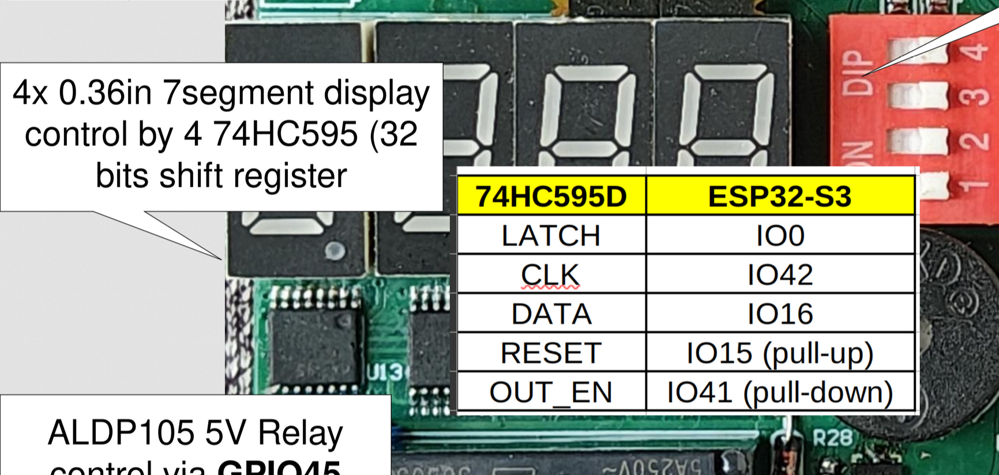

********************************************************************
Project 7 : 4-Digit 7-Segment Display Using 74HC595 Shift Registers
********************************************************************

Introduction
============ 

In this tutorial, you will learn how to display numbers on a **4-digit 7-segment display** using an MCU and four **74HC595 shift registers**.

Instead of connecting each LED segment directly to the MCU, the 74HC595 shift registers greatly reduce the number of GPIO pins required. Only **three MCU pins** are needed to control all four displays.

After completing this tutorial, you will be able to:

* Display numbers from **0** to **9999**.
* Display negative numbers.
* Display decimal points.
* Understand how the MCU communicates with multiple shift registers.

Requirements
============

Before starting, make sure you have the following:

* The STEAM development board 
* USB cable
* Arduino IDE with ESP32 toolchain installed

In this project, the built-in 7segment display with 7HCc595 be used. 

   The interfacing description of the microcontroller board 

74HC595s are connected to the MCU as follows:

==================  ==========================
MCU Pin             74HC595 Pin
==================  ==========================
`DATA_PIN` (16)     DS (Serial Data)
`CLOCK_PIN` (42)    SH_CP (Shift Clock)
`LATCH_PIN` (0)     ST_CP (Latch Clock)
==================  ==========================

Shift Register Connections
^^^^^^^^^^^^^^^^^^^^^^^^^^
Connect the four 74HC595 shift registers in a daisy chain.

* Q7S of Register 1 → DS of Register 2
* Q7S of Register 2 → DS of Register 3
* Q7S of Register 3 → DS of Register 4

All registers share the same clock and latch signals.

Segment Connections
^^^^^^^^^^^^^^^^^^^
Each shift register controls one 7-segment display.

=================  ===========
74HC595 Output     Segment
=================  ===========
Q0                 A
Q1                 B
Q2                 C
Q3                 D
Q4                 E
Q5                 F
Q6                 G
Q7                 DP
=================  ===========

.. note::

This project uses **common-anode** displays.

* Segment output LOW = LED ON
* Segment output HIGH = LED OFF

Writing the Program
===================

Create a new sketch in the MCU IDE and enter the following code:

Pin Definitions
^^^^^^^^^^^^^^^
.. code-block:: cpp

    // ── Pin definitions ──────────────────────────────────────────────────────────
    const int DATA_PIN  = 16;   // DS   (pin 14 of 74HC595)
    const int CLOCK_PIN = 42;   // SH_CP (pin 11 of 74HC595)
    const int LATCH_PIN = 0;  // ST_CP (pin 12 of 74HC595)

These three constants specify which MCU GPIO pins are connected to the first 74HC595 shift register.

`DATA_PIN`

The data pin sends binary data to the shift register one bit at a time.

`CLOCK_PIN`

The clock pin tells the shift register when to read the current data bit. Every clock pulse moves one bit into the register.

`LATCH_PIN`

The latch pin transfers all shifted data to the output pins simultaneously. Without the latch pin, the display would change while data is still being transmitted.

Segment Lookup Table
^^^^^^^^^^^^^^^^^^^^

.. code-block:: cpp

    // ── Segment encoding (Common Anode → active LOW, so bits are inverted) ───────
    //
    //  Bit position:  7   6   5   4   3   2   1   0
    //  Segment:       DP  G   F   E   D   C   B   A
    //
    //  For common anode, 0 = segment ON, 1 = segment OFF.
    //
    //       AAA
    //      F   B
    //      F   B
    //       GGG
    //      E   C
    //      E   C
    //       DDD  DP

    // Lookup table for digits 0–9 (index 10 = blank, index 11 = dash '-')
    // Stored as active-HIGH patterns; we invert when sending to the shift register.
    //                          PGFEDCBA
    const uint8_t DIGITS[] = {
    0b00111111,  // 0  — A B C D E F
    0b00000110,  // 1  — B C
    0b01011011,  // 2  — A B D E G
    0b01001111,  // 3  — A B C D G
    0b01100110,  // 4  — B C F G
    0b01101101,  // 5  — A C D F G
    0b01111101,  // 6  — A C D E F G
    0b00000111,  // 7  — A B C
    0b01111111,  // 8  — A B C D E F G
    0b01101111,  // 9  — A B C D F G
    0b00000000,  // 10 — blank (all off)
    0b01000000,  // 11 — dash  (G only)
    };

    const int BLANK = 10;
    const int DASH  = 11;

 
the `DIGITS` array stores the segment pattern for each number.

Each element of the array is one byte (8 bits).

Each bit controls one segment of the display.

================== ==================
Bit                Segment
================== ==================
Bit 0              A
Bit 1              B
Bit 2              C
Bit 3              D
Bit 4              E
Bit 5              F
Bit 6              G
Bit 7              Decimal Point
================== ==================

For example,

.. code-block:: cpp

    0b00111111

represents the number `0`.

The binary value indicates that segments A, B, C, D, E and F are ON, while segment G is OFF.
 
Likewise,

.. code-block:: cpp

    0b00000110

lights only segments B and C, producing the digit `1`.

The lookup table allows the program to display numbers simply by indexing the array instead of calculating which segments should be lit every time.

.. note:: **Special Symbols**

    The lookup table also contains two special characters.

    * **BLANK:** Turns every segment OFF, mainly used to remove leading zeros.
    * **DASH:** Displays only the middle segment (G), used to display negative numbers or error messages.

The `shiftOutByte()` Function
^^^^^^^^^^^^^^^^^^^^^^^^^^^^^
This function sends one byte (8 bits) to the daisy-chained shift registers using a for loop. The byte that represents which segments should be turned on or off. The function starts with the most significant bit (MSB).

Each iteration of the loop performs three steps:

    1. Pull the clock pin LOW.
    2. Output one data bit.
    3. Pull the clock pin HIGH.

.. code-block:: cpp

    // ── Core shift-register function ─────────────────────────────────────────────

    /**
    * Send one byte to the shift register chain.
    * MSB first. Clock is generated manually (no SPI) for simplicity.
    */
    void shiftOutByte(uint8_t value) {
    for (int i = 7; i >= 0; i--) {
        digitalWrite(CLOCK_PIN, LOW);
        digitalWrite(DATA_PIN, (value >> i) & 0x01);
        digitalWrite(CLOCK_PIN, HIGH);
        }
    }

Every rising edge of the clock shifts one bit into the 74HC595. After eight clock pulses, the entire byte has been stored.

The `displayDigits()` Function
^^^^^^^^^^^^^^^^^^^^^^^^^^^^^^
The function retrieves the segment pattern for each digit from the DIGITS lookup table, inverts the bits because the displays are common-anode, optionally enables the decimal points, and shifts the four bytes into the daisy-chained 74HC595 shift registers. Finally, the latch pin is toggled to update all four displays simultaneously.

.. code-block:: cpp

    /**
    * Display a 4-digit number on the displays.
    *
    * @param d1  Leftmost digit  (digit index: 0–9, BLANK, or DASH)
    * @param d2  Second digit
    * @param d3  Third digit
    * @param d4  Rightmost digit
    * @param dp  Bitmask for decimal points: bit3=d1, bit2=d2, bit1=d3, bit0=d4
    */
    void displayDigits(int d1, int d2, int d3, int d4, uint8_t dp = 0) {
    // For common-anode, invert the segment pattern (0 = ON).
    // The 74HC595s are daisy-chained, so the LAST byte clocked in
    // ends up in the FIRST 595 (leftmost digit). Send right-to-left.
    uint8_t patterns[4];
    patterns[0] = ~DIGITS[d4];  // leftmost
    patterns[1] = ~DIGITS[d3];
    patterns[2] = ~DIGITS[d2];
    patterns[3] = ~DIGITS[d1];  // rightmost

    // Apply decimal points (bit = 0 → DP ON for common anode)
    for (int i = 0; i < 4; i++) {
        bool dpOn = (dp >> (3 - i)) & 0x01;
        if (dpOn) {
        patterns[i] &= ~(1 << 7);  // clear bit 7 (DP) to turn ON
        } else {
        patterns[i] |=  (1 << 7);  // set   bit 7 (DP) to turn OFF
        }
    }
    // Latch LOW → shift data → Latch HIGH to update outputs
    digitalWrite(LATCH_PIN, LOW);

    // Clock in from rightmost digit to leftmost (daisy-chain order)
    for (int i = 3; i >= 0; i--) {
        shiftOutByte(patterns[i]);
    }

    digitalWrite(LATCH_PIN, HIGH);
    }

The `displayNumber()` Function
^^^^^^^^^^^^^^^^^^^^^^^^^^^^^^
The function first checks whether the number is within the supported range (-999 to 9999). It then detects negative numbers, extracts each decimal digit using division and modulus operations, suppresses unnecessary leading zeros, and calls displayDigits() to show the final result.

.. code-block:: cpp

    /**
    * Display a signed integer (-999 to 9999).
    * Numbers out of range show "----".
    *
    * @param number  Value to display
    * @param dp      Decimal point bitmask (bit3=d1 … bit0=d4)
    */
    void displayNumber(int number, uint8_t dp = 0) {
    if (number > 9999 || number < -999) {
        // Out of range → show dashes
        displayDigits(DASH, DASH, DASH, DASH);
        return;
    }

    bool negative = (number < 0);
    if (negative) number = -number;

    int d4 =  number % 10;
    int d3 = (number / 10)   % 10;
    int d2 = (number / 100)  % 10;
    int d1 = (number / 1000) % 10;

    // Suppress leading zeros
    if (number < 1000) {
        d1 = negative ? DASH : BLANK;  // leading sign or blank
        if (number < 100)  d2 = BLANK;
        if (number < 10)   d3 = BLANK;
    }

    displayDigits(d1, d2, d3, d4, dp);
    }

The `setup()` and `loop()` Functions
^^^^^^^^^^^^^^^^^^^^^^^^^^^^^^^^^^^^

The setup function configures the DATA, CLOCK, and LATCH pins as outputs and displays 0 on the 4-digit display as the initial value.

The loop function epeatedly performs several examples, including counting from 0 to 9999, displaying a decimal number, showing a negative number, and displaying four manually specified digits

.. code-block:: cpp

    // ── Setup & Loop ─────────────────────────────────────────────────────────────
    void setup() {
    pinMode(DATA_PIN,  OUTPUT);
    pinMode(CLOCK_PIN, OUTPUT);
    pinMode(LATCH_PIN, OUTPUT);

    // Show "0" at startup
    displayNumber(0);
    }

    void loop() {
    // ── Example 1: Count 0 → 9999, one step per 50 ms ──
    for (int i = 0; i <= 9999; i++) {
        displayNumber(i);
        delay(10);
    }

    // ── Example 2: Show a fixed value with a decimal point ──
    // Displays "12.34" (decimal point between digit 2 and 3 → bit1 set)
    displayNumber(1234, 0b0010);
    delay(2000);

    // ── Example 3: Show a negative number ──
    displayNumber(-42);
    delay(2000);

    // ── Example 4: Show individual digit patterns directly ──
    displayDigits(1, 2, 3, 4);   // shows  1 2 3 4
    delay(2000);
    }

Program Flow
^^^^^^^^^^^^
The overall execution flow of the program is:

1. MCU initializes the GPIO pins.
2. `displayNumber()` converts a number into four digits.
3. `displayDigits()` converts each digit into segment patterns.
4. `shiftOutByte()` sends the patterns to the 74HC595 shift registers.
5. The latch signal updates all four displays simultaneously.
6. The process repeats whenever a new number is displayed.

Expected Result
^^^^^^^^^^^^^^^
After uploading the sketch:

* The display initially shows `0`.
* The display counts from `0000` to `9999`.
* After the counter finishes, `12.34` is displayed.
* Next, the display shows `-42`.
* Finally, the display shows `1234` before repeating the demonstration.

.. figure:: ../../img/7segs.gif
   :align: center
   :figclass: align-center

Experiment
==========
Try modifying the program to better understand how it works.

* Change the counting speed by modifying the delay.

  .. code-block:: cpp

    delay(100);

* Display your favorite number.

  .. code-block:: cpp

    displayNumber(2026);

* Display a decimal value.

  .. code-block:: cpp

    displayNumber(3141, 0b0010);

* Display four individual digits.

  .. code-block:: cpp

    displayDigits(4, 3, 2, 1);

* Modify the `DIGITS` lookup table and observe how changing the segment patterns affects the displayed characters.

Summary
=======
In this tutorial, you learned how to control a 4-digit 7-segment display using four 74HC595 shift registers and only three MCU GPIO pins.

You learned how to:

* Connect multiple 74HC595 shift registers in a daisy chain.
* Drive common-anode 7-segment displays.
* Display integers from `0` to `9999`.
* Display negative numbers and decimal points.
* Convert numbers into segment patterns using a lookup table.
* Update all four displays simultaneously using the latch signal.

This project introduces the use of shift registers for expanding MCU outputs and provides a foundation for building digital clocks, timers, counters, measurement displays, and other numeric display applications.
