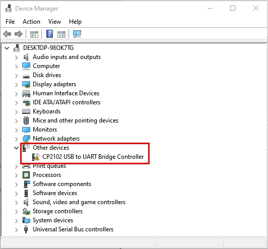
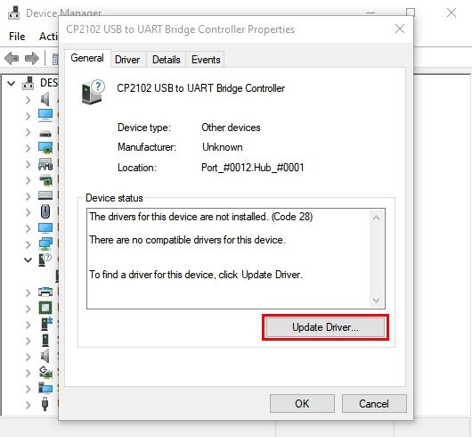
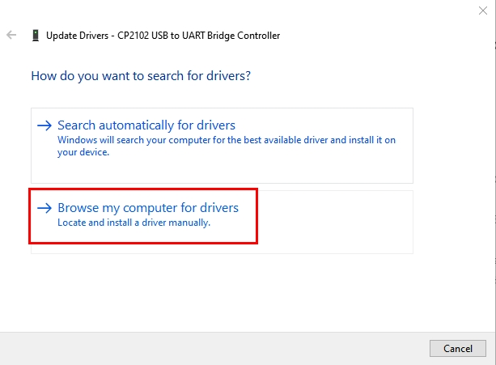
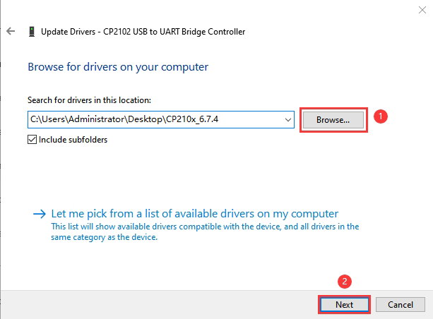
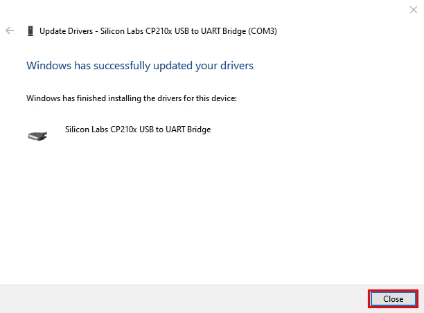
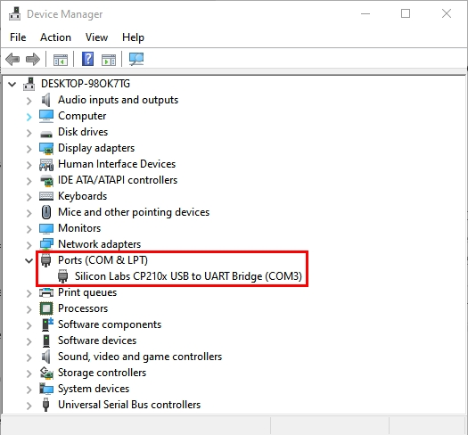

# **Install CP2102 Driver on Windows System**

Download: [Windows driver](https://www.silabs.com/software-and-tools/usb-to-uart-bridge-vcp-drivers?tab=downloads)

<!-- Click the link to download , and we unzip it to . 

Unzip again and we will get the folder . Please remember the path of this folder for later use.  -->

 Right click Computer----- Properties----- Device Manager.  

The yellow exclamation mark on the page implies an unsuccessful  installation and you should double click , then click “**Update Drive...**”to update the driver. 

Click “**Browse my computer for drivers**” to find the downloaded Arduino software.

There is a DRIVERS folder in Arduino software installed package, please open this folder and check the driver of CP210X series chips.

Click “Browse...”, then search the driver of CP2102 and click“Next”.

After a while, the driver is installed successfully.

 

When opening the device manager, we will find that the yellow exclamation mark disappears, which means the driver of CP2102 is installed successfully.

