********************************************
User manual
********************************************
.. rst-class:: justified-text

The STEAM development kit is a open-source low-cost versatile microcontroller development board with advance peripheral like USB, VGA, ethernet,..
Aiming at beginners such as students and enthusiasts. 

Hardware Overview 
=================
The The STEAM development kit is consists of 2 different boards, connected by the 2.54mm header:

**The main microcontroller board:**

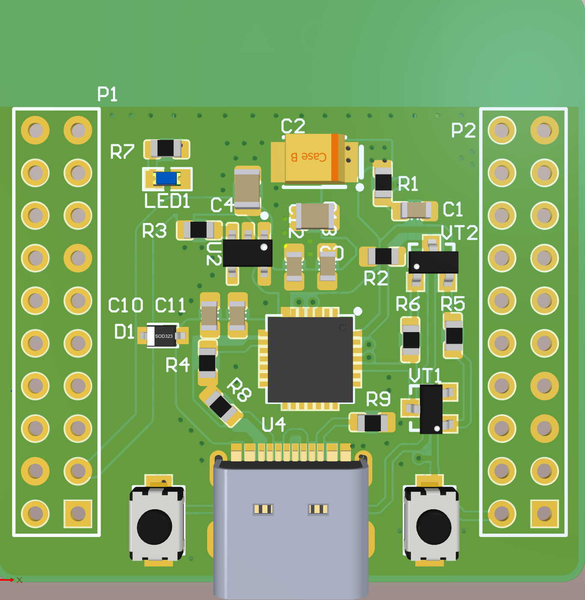

   The 3D rendering of the maincontroller board 

The microcontroller board is designed to be small but include all of the necessary components for it to work standalone independently with the peripheral board. It also exposes all of the GPIOs for user and for interfacing with the peripheral board.

**The main peripheral board:**

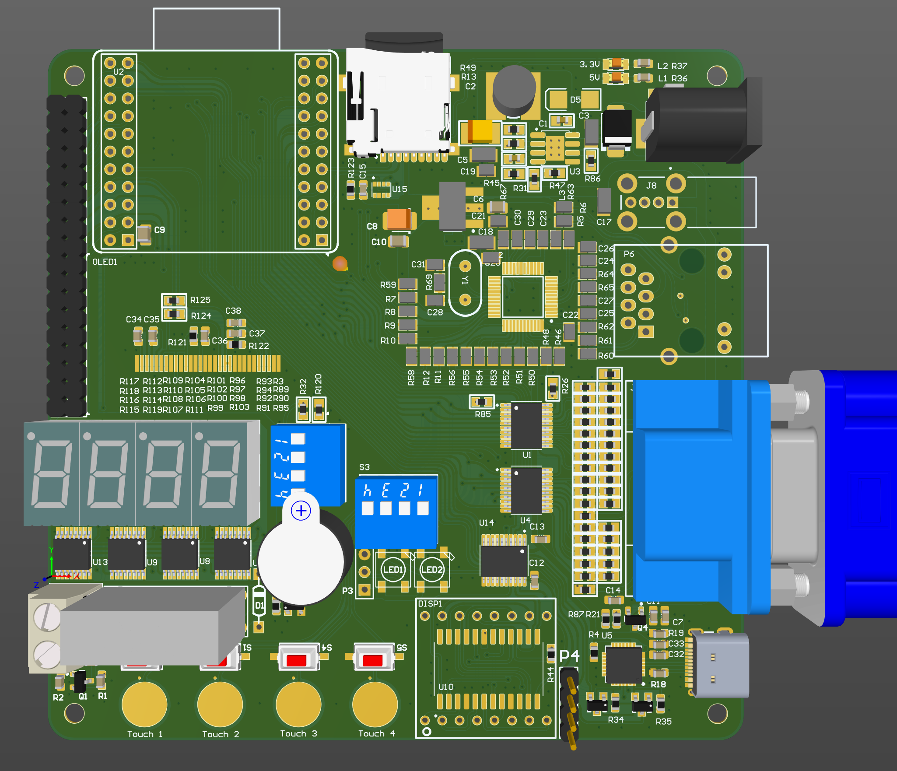

   The 3D rendering of the peripheral board 

The peripheral board is designed to carry the microcontroller board as a daughter borad, where all of the processing logic is happened. Unlike the microcontroller board it cannot operate independently, the microntroller board need to be present for it to work. 

With this architecture the microcontroller can be flexibly change to different MCU families or even FPGA, CLPD. Where the daughter microcontroller board can either work alone or expand it peripheral. 

Specification
=============
The STEAM development kit **microcontroller board** is equipped with:

* ESP32-S3 WROOM N8R16 (8MB of FLASH, 16MB of PSRAM), 2x xtensa LX7
* Built in 2.4 GHz Wi-Fi (802.11 b/g/n), Bluetooth 5.0 LE 
* Built in 45 programmable GPIOs, SPI, I2S, I2C, PWM, RMT, ADC and UART, SD/MMC host and TWAI
* USB-C port connect directly to the MCU USB pins
* Power supply: 

  - AP2112 low drop-out 5V to 3.3V @ 600 mA linear regulator

The STEAM development kit **peripheral board** is equipped with:

* W5500 SPI ethernet chip with built in TCP/IP support
* CP2102 USB to UART
* 16 bits VGA output 
* SH1106 1.3 inch single color OLED
* MAX7210 8x8 dot matrix led display
* 4x0.36 in 7 segment LED display controlled with 4x 74HC595D
* 2x WS2812 RGB LEDS
* Panasonic ALDP relay and 5V buzzer
* BM280 pressure and temperature sensor
* MircoSD and USB-A ports
* Power supply: 

  - MP1854 DC-DC buck converter 9-28V input, 5V 3A output
  - NCP1117 Linear regulator 5v to 3.3V @ 1A

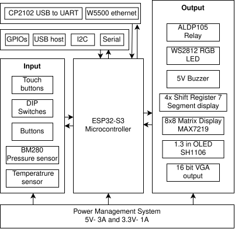

   The block diagram of The STEAM development kit system

GPIOs and Peripherals
=====================
**The microcontroller board interfacing details:**

.. figure:: img/MCU_board.png
   :align: center
   :width: 400
   :figclass: align-center

   The interfacing description of the microcontroller board 

The main peripherals of the microcontroller board is the USB-C port and GPIOs for interfacing with the peripheral board.

**The peripheral board interfacing details:**

.. figure:: img/full_board.png
   :align: center
   :figclass: align-center

   The interfacing description of the peripheral board 

The peripheral board contains different devices and components, however due to the limitation of the numbers of GPIOs, some functions have to share the GPIOs which is a limitation where not all functions of the development kit can be used simultaneously.

Shared HW resources
===================

Shared SPI bus
^^^^^^^^^^^^^^
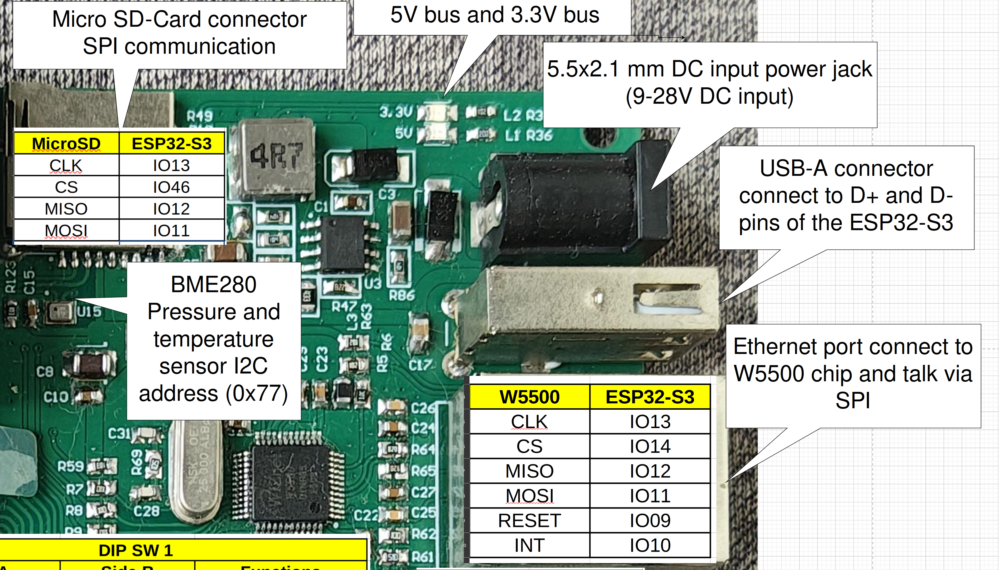

   The shared SPI devices between microSD card and the W5500 ethernet chip

Since both of the microSD card and the W5500 ethernet chip are slaves, the main microcontroller is the master. The SPI communication protocol allows one multiple slaves, with the communication is held by the master. The design here follows mult-drop configuration where each slaves is controlled with a separated Chip select (CS) pin.

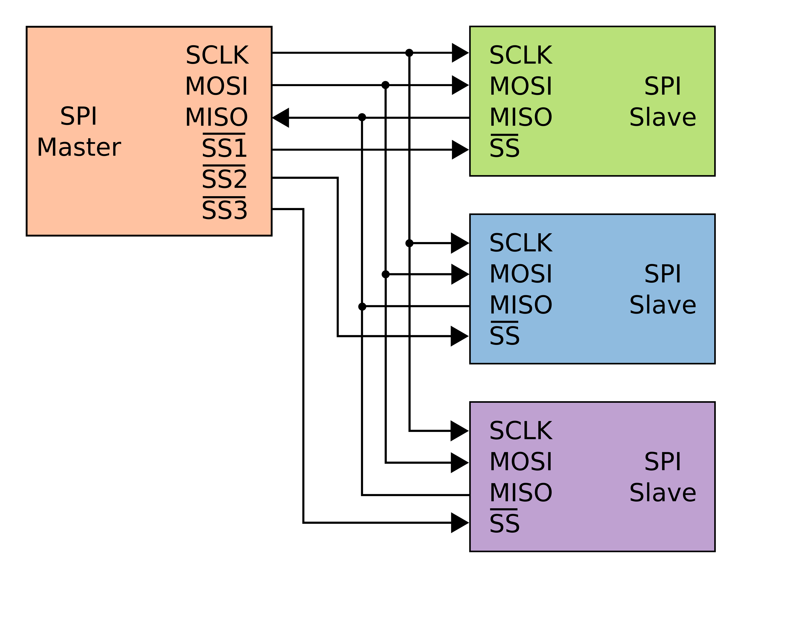

   SPI mult-drop configuration

However, due to the data intensive nature of both ethernet and MicroSD card interface, the firmware implementation of this 2 functions shall consider the resources carefully. To give each device a handling task that do not collide with each other writing or reading data at the same time.

Shared I2c bus
^^^^^^^^^^^^^^
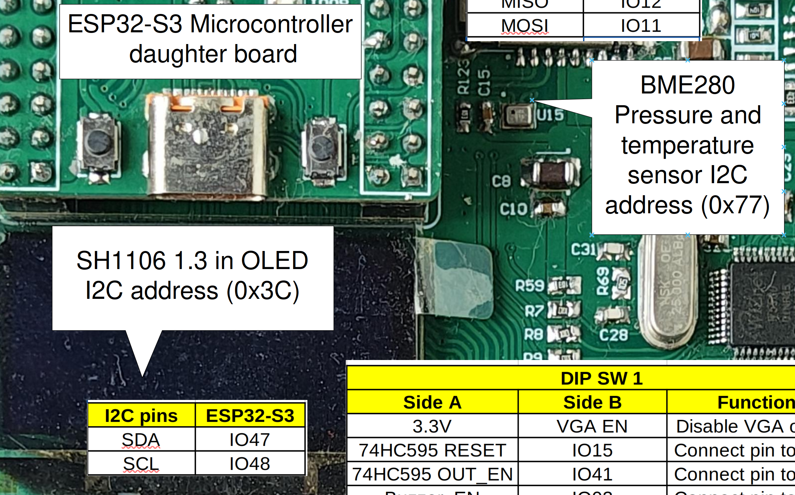

   The shared SPI devices between 1.3 inch OLED card and the BME280 pressure and temperatures sensor

The I2c or TWI protocol is designed with multiple devices sharing 1 physical bus (2 wire), allowing multiple slaves and masters. The nodes are differentiated by their addresses.

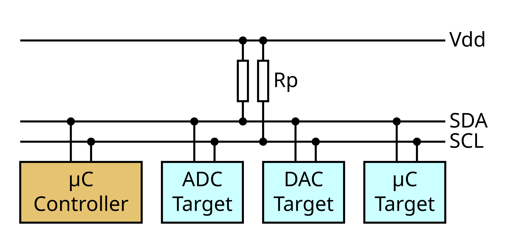

   I2C multiple devices bus

In this design, the OLED has I2C address of 0x3C and 0x77 for the sensor. The I2C handler of the ESP32-S3 can handle I2C message queue. 
Therfore, using 2 devices simultaneously would not be a issue, but user still need to aware that I2C transmissions between different devices need to be done sequentially for better implement the software.

Shared 16 bits VGA GPIOs with buzzer LED display functions 
^^^^^^^^^^^^^^^^^^^^^^^^^^^^^^^^^^^^^^^^^^^^^^^^^^^^^^^^^^

   The shared GPIOs between 16 bits VGA output and 8x8 matrix LED, 7 segment LEDs, DIP switch/ touch buttons /buttons and buzzer

Due to the resistor ladder of driving VGA signal for 16 bits color is 20 GPIOs, the numbers of GPIOs left is not enough for all functions, hence the GPIO is shared.
The output of VGA resistor ladder is isolated by the 74LCV245 bus transceiver ICs, hence we have the limitation of when using the VGA output functions the 8x8 matrix, display, 7segment display, buzzer, buttons and DIP switch is not available.
Only when VGA is not used then, those function can be accessible. 

The following quirk of using those function should be **notice**:

* The LED matrix and 7segment can be initialized before initializing the VGA output is initialized, but cannot and should not attempt to be refreshed.
* To use the **VGA output**, ensure to put all switches in the DIP switches 1 and 2 to **OFF** position

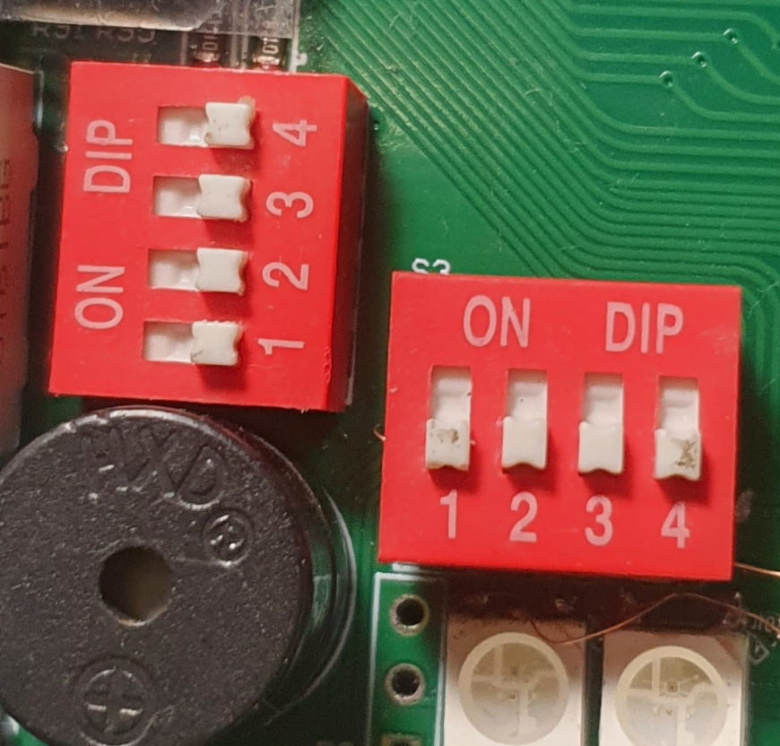

   DIP switches position for VGA output

* To use the **Buzzer**, put switch 4 of DIP 1 to ON, the it could be controlled by **GPIO3**:
   .. figure:: img/buzz_ON.png
      :align: center
      :width: 200
      :figclass: align-center

      DIP switch 1 position for enabling Buzzer 

* It's not necessary to change DIP switch config to display on **7 Segment Display**, but if RESET and brightness PWM control is needed,  put switch 2 and 3 of DIP 1 to ON:

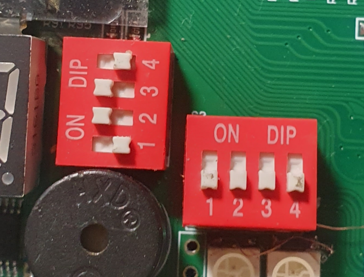

   DIP switch 1 position for controlling RESET and Brightness of 7 segment Display
    
* To disable the VGA display, put switch 4 of DIP 1 to ON:

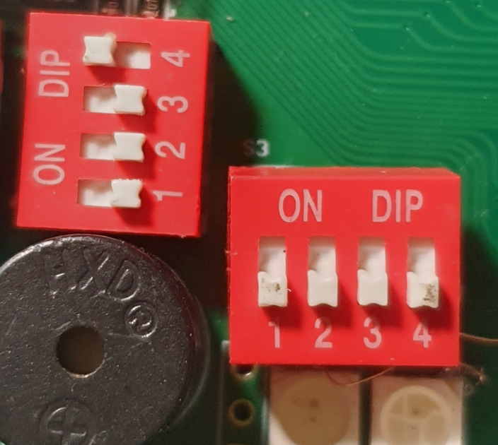

   DIP switch 1 position for disabling the VGA output

Using the board
================
Powering up the board
^^^^^^^^^^^^^^^^^^^^^
To power up the board, either use the USB-C ports on the board or the DC barrel on the board. Make sure to use the correct power supply for for the board:

* **5V 1A** for powering via USB, USB-PD charger can be used !
* **9-28V 500mA** for powering via DC 5.5x2.1mm barrel jack

.. note::
   When both DC jack and USB are plugged in, the board will use **DC jack** as primary power source.

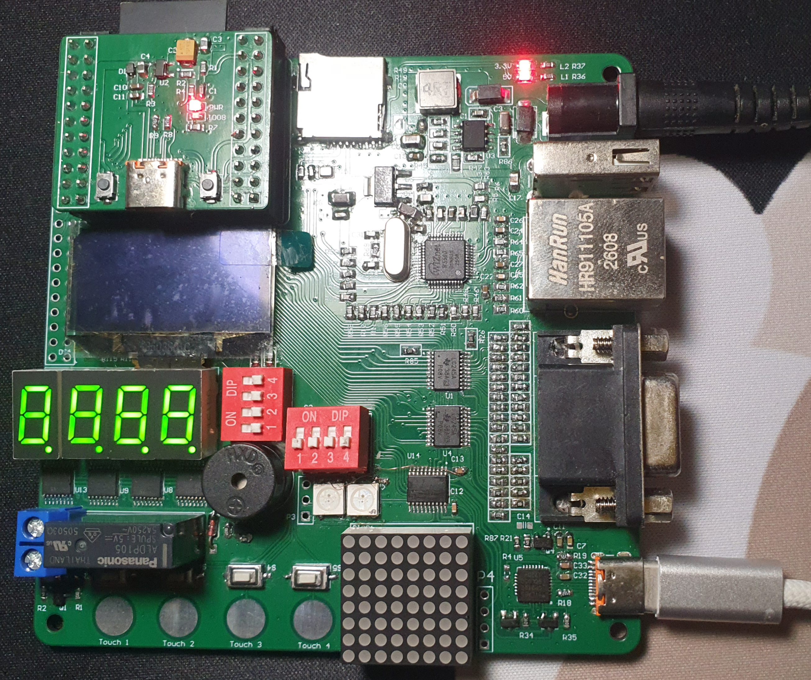

   Powering up the development kit

When the board is properly powered, all three power LEDs indicator should light up like the in the picture

.. warning:: 
   If any of the 3 LED is not brighten up, please check the power supply and debug based on the schematic of following 3 voltage rails:
   
   - 3.3V on the mainboard, upper LED on the top right conner
   - 5V on mainboard, lower LED on the top right conner
   - 3.3V on the microcontroller board, LED on the daughter board

Conneting the devolopment board to PC
^^^^^^^^^^^^^^^^^^^^^^^^^^^^^^^^^^^^^
Connect the board to the PC using the USB-C port, in most operating systems, it will be recognized directly as a USB Serial device with the name of *Silicon Labs CP210x USB to UART Bridge*, you can check if the board is recognized by the PC as:

Windows 
*******
Right Click on **This PC->manage->Device Manager -> Port(COM&LPT)**

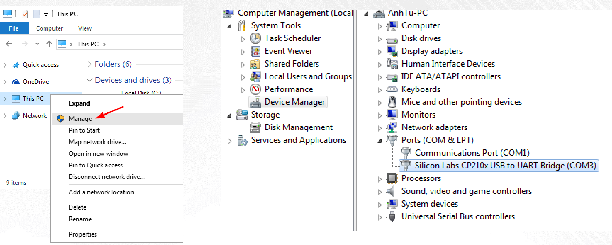

   Check if Windows recognized the board

If the the device show up but driver is not installed properly, please use Windows update to install the driver, or manually `download the driver and install it  <https://www.silabs.com/software-and-tools/usb-to-uart-bridge-vcp-drivers?tab=downloads>`_  .

`Following this instruction here <windows_driver.html>`_ 

Linux
*****
Use this command to check if the board is properly recognized:

.. code-block:: bash
   dmesg

The result should look like this:

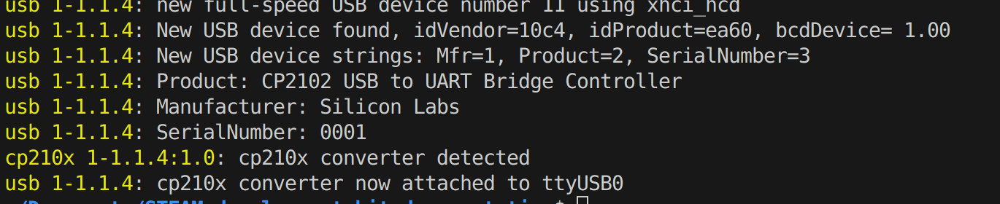

   DMESG response

MacOS
*****
You can use the exact same method on Linux to check if it's recognized. 
If it's the first time connecting such device, usually the driver need to be installed, get it `here <https://www.silabs.com/software-and-tools/usb-to-uart-bridge-vcp-drivers?tab=downloads>`_  and follow this `instruction <mac_driver.html>`_